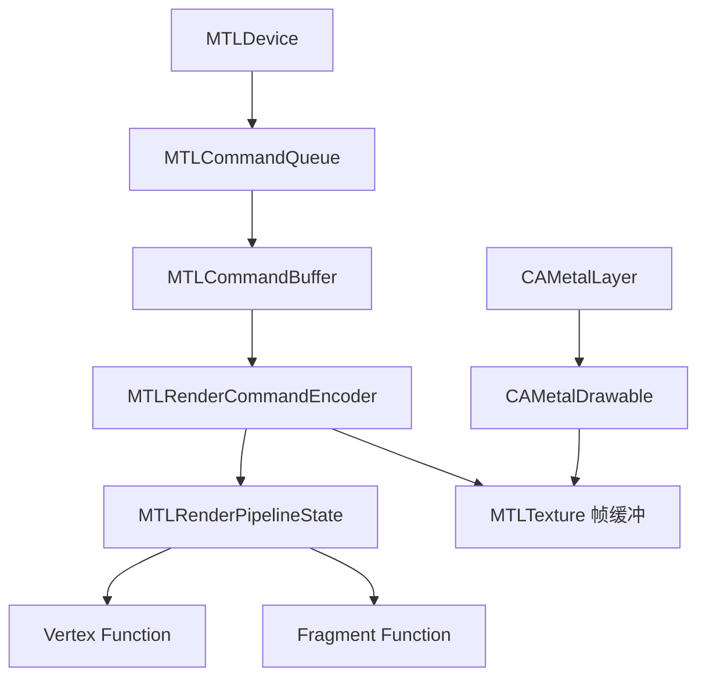
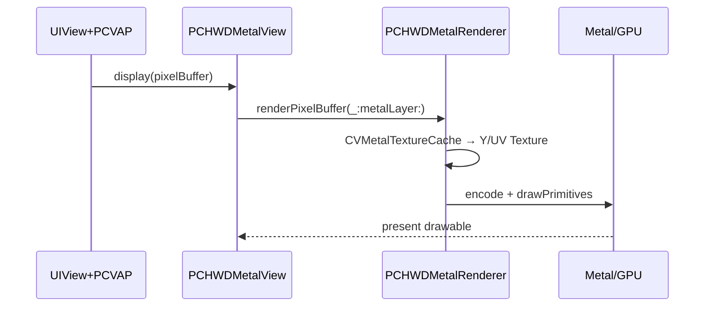

# Metal 学习路径：从入门到读懂 PCVapPlayer

本文档面向需要在 **PartyClub / PCVapPlayer** 场景下维护或扩展 GPU 渲染能力的 iOS 工程师。目标不是成为图形学研究员，而是能：

1. 理解 Metal 渲染管线与 MSL 着色器基础；
2. 跟通一帧 VAP/HWD 视频从 `CVPixelBuffer` 到屏幕的完整路径；
3. 能安全修改 YUV 色彩、Alpha 布局、蒙版/附件等已有能力。

> **代码仓库参考路径**（partyclub_pro）：`BaseModules/PCVapPlayer/`

---

## 1. 为什么要学 Metal（在本项目里）

| 场景 | 技术选型 | 模块 |
|------|----------|------|
| 普通 HWD 硬解 MP4 动画 | `CAMetalLayer` + YUV Fragment Shader | `PCHWDMetalView` / `PCHWDMetalRenderer` |
| VAP 特效（蒙版、附件、文字） | 扩展 Vertex + 多纹理 Fragment | `PCVAPMetalView` / `PCVAPMetalRenderer` |
| 着色器兜底编译 | 内嵌 MSL 字符串 | `PCShaderSourceDefine.swift` |
| 与 UI 集成 | Associated Object 挂 Metal View | `UIView+PCVAP.swift` |

模拟器 **不支持** Metal 真机路径，相关类在 `#if targetEnvironment(simulator)` 下为空实现，调试需用真机。

---

## 2. 核心概念速查

### 2.1 对象层级（Render Pipeline）



| 类型 | 作用 | PCVapPlayer 中的对应 |
|------|------|----------------------|
| `MTLDevice` | GPU 入口 | `kPCHWDMetalRendererDevice`（`PCMacros.swift`） |
| `MTLCommandQueue` | 提交命令 | `PCHWDMetalRenderer.commandQueue` |
| `MTLRenderPipelineState` | 顶点+片元+像素格式 | `setupPipelineStates` 中创建 |
| `MTLBuffer` | 顶点、Uniform（YUV 矩阵） | `vertexBuffer`、`yuvMatrixBuffer` |
| `MTLTexture` | 采样源 / 绘制目标 | Y/UV 平面、`drawable.texture` |
| `CVMetalTextureCache` | PixelBuffer → Texture 零拷贝 | `videoTextureCache` |

### 2.2 一帧渲染顺序（HWD 路径）

对照 `PCHWDMetalRenderer.renderPixelBuffer(_:metalLayer:)`：

1. 校验 `metalLayer` 尺寸与 superlayer；
2. `updateMetalPropertiesIfNeed`：按 `CVPixelBuffer` 附件选择 BT.601 / BT.709 矩阵；
3. `CVMetalTextureCacheCreateTextureFromImage`：Plane0 → `.r8Unorm`（Y），Plane1 → `.rg8Unorm`（UV）；
4. `metalLayer.nextDrawable()` 获取当前帧缓冲；
5. 构建 `MTLRenderPassDescriptor`（`loadAction = .clear`）；
6. `setRenderPipelineState` → `setVertexBuffer` → `setFragmentBuffer` → `setFragmentTexture` × 2；
7. `drawPrimitives(.triangleStrip, vertexCount: 4)`；
8. `present(drawable)` + `commit()`。

### 2.3 顶点与 Alpha 布局

`PCHWDMetalRenderer` 根据 `PCTextureBlendMode` 选择四组预置顶点（左/右/上/下 Alpha 条带），见 `kQGQuadVerticesConstants`。每个顶点包含：

- `position`（NDC 裁剪空间）
- `textureColorCoordinate`（RGB 区域 UV）
- `textureAlphaCoordinate`（Alpha 区域 UV）

Swift 侧结构体定义在 `PCShaderTypes.swift`，须与 `PCShaderSourceDefine.swift` 内 MSL `typedef` **字段顺序、对齐一致**。

### 2.4 YUV → RGB

Fragment Shader（`hwd_yuvFragmentShader` / `vap_yuvFragmentShader`）采样 Y + UV，乘以 `PCColorParameters.matrix`（`matrix_float3x3`）与 `offset`。项目内预置矩阵：

- `kQGColorConversionMatrix601FullRangeDefault`
- `kQGColorConversionMatrix709FullRangeDefault`

**注意**：`PCColorParameters` 的 Buffer 长度应使用 `MemoryLayout.stride`（64 字节对齐），不要用 `size`（56），否则 GPU 读 Uniform 错位。

### 2.5 着色器加载策略

`PCMetalShaderFunctionLoader` 优先加载 **预编译** `.metallib`；失败时回退到 `PCShaderSourceDefine.swift` 中的 MSL 字符串运行时编译。文件头注释要求：

> 所有 `.metal` 文件更新，都需要同步到 `PCShaderSourceDefine.swift`。

---

## 3. 官方与社区资料

### 3.1 必读官方

| 资料 | 链接 |
|------|------|
| Metal 概览 | https://developer.apple.com/metal/ |
| Metal Programming Guide | https://developer.apple.com/library/archive/documentation/Miscellaneous/Conceptual/MetalProgrammingGuide/ |
| Metal Shading Language（MSL） | https://developer.apple.com/metal/Metal-Shading-Language-Specification.pdf |
| Metal Best Practices | https://developer.apple.com/metal/Metal-Best-Practices-Guide.pdf |
| Metal 示例代码 | https://developer.apple.com/metal/sample-code/ |
| Core Video + Metal | https://developer.apple.com/documentation/corevideo |

### 3.2 WWDC（按主题搜视频）

- Introducing / What's New in Metal（每年概览）
- Optimizing Metal Performance / Debugging Metal
- 视频相关：Camera、Video Processing、Display HDR

### 3.3 书籍与教程

| 资料 | 说明 |
|------|------|
| *Metal by Tutorials*（Kodeco） | Swift 实战，适合 iOS |
| metalbyexample.com | 短示例，概念清晰 |
| Ray Wenderlich Metal Getting Started | 三角形 → 纹理入门 |

### 3.4 专题关键词（按需检索）

- `CVMetalTextureCache` `NV12` `YUV Metal`
- `CAMetalLayer` `nextDrawable` `presentDrawable`
- `premultiplied alpha` dual texture coordinates
- `MemoryLayout stride` Metal buffer alignment

---

## 4. 三周学习计划（可执行）

### 第 1 周：管线基础 + 最小 Demo

| 天 | 阅读 / 练习 | 产出 |
|----|-------------|------|
| D1 | Programming Guide：Overview、Resource Objects | 画出 Device→Queue→Buffer 关系图 |
| D2 | 新建 Demo：`CAMetalLayer` + 清屏单色 | 理解 `drawableSize`、`pixelFormat` |
| D3 | Demo：画一个三角形（硬编码顶点） | 理解 Vertex / Fragment、NDC 坐标 |
| D4 | Demo：贴一张 `UIImage`（`MTKTextureLoader`） | 对照 `PCTextureLoader.loadTexture` |
| D5 | MSL 入门：texture2d、sampler、返回值 | 阅读 `PCShaderSourceDefine` 中 `hwd_vertexShader` |
| D6 | 复习 + 整理笔记 | 能口述 Render Pass 各字段含义 |
| D7 | 休息或补漏 | — |

**本周不必打开 PCVapPlayer**，先建立独立心智模型。

### 第 2 周：视频纹理 + 读 HWD 路径

| 天 | 阅读 / 练习 | 对照源码 |
|----|-------------|----------|
| D8 | Core Video：`CVPixelBuffer` 平面、格式 | `PCMP4FrameHWDecoder` 输出 |
| D9 | `CVMetalTextureCacheCreateTextureFromImage` 文档 | `PCHWDMetalRenderer` L279–328 |
| D10 | YUV 色彩空间（601/709、Full/Limited） | `updateMetalPropertiesIfNeed` |
| D11 | 通读 `PCHWDMetalView` + `display(_:)` 调用链 | `UIView+PCVAP.swift` L753、L925 |
| D12 | 通读 `PCHWDMetalRenderer` 初始化与 `dispose` | 理解资源重建 `reconstructIfNeed` |
| D13 | 真机断点：一帧从 decode 到 `commit` | 记录调用栈截图 |
| D14 | 修改实验：改 `clearColor` 或 blendMode | 验证 Alpha 左/右/上/下 |

### 第 3 周：VAP 扩展 + 性能

| 天 | 阅读 / 练习 | 对照源码 |
|----|-------------|----------|
| D15 | 多读 UV：`PCVAPVertex`、mask 坐标 | `PCVAPMetalRenderer` |
| D16 | Attachment Shader：`vapAttachment_*` | `PCMetalUtil.swift` 常量名 |
| D17 | `PCTextureLoader`：颜色填充、文字图集 | `PCVapAttachmentFragmentParameter` |
| D18 | Best Practices：Pipeline 缓存、少分配 | `dispose` / `reconstructIfNeed` 设计意图 |
| D19 | 读 `PCShaderSourceDefine` 全文 | 理解兜底编译与 `.metal` 同步规则 |
| D20 | 模拟一次 Bug：矩阵 stride 错误 / 纹理格式错误 | 对照注释中的 56 vs 64 |
| D21 | 写一页「组内分享」提纲 | 给后续维护者 |

---

## 5. 源码导读地图

### 5.1 目录与职责

```
PCVapPlayer/
├── Shaders/
│   ├── PCShaderTypes.swift          # Swift 与 MSL 共享的结构体
│   └── PCShaderSourceDefine.swift   # MSL 源码字符串（兜底）
├── Classes/
│   ├── UIView+PCVAP.swift           # 创建 MetalView、喂 pixelBuffer
│   ├── Views/Metal/
│   │   ├── PCHWDMetalView.swift
│   │   ├── PCHWDMetalRenderer.swift
│   │   └── Vapx/
│   │       ├── PCVAPMetalView.swift
│   │       └── PCVAPMetalRenderer.swift
│   ├── Models/PCTextureLoader.swift
│   ├── Utils/
│   │   ├── PCMetalUtil.swift
│   │   └── PCMetalShaderFunctionLoader.swift
│   └── Controllers/Decoders/PCMP4FrameHWDecoder.swift
```

### 5.2 入口调用链（简化）



### 5.3 Shader 函数名索引

| 函数名 | 用途 |
|--------|------|
| `hwd_vertexShader` | HWD 顶点变换 |
| `hwd_yuvFragmentShader` | HWD YUV 合成 + Alpha |
| `vap_vertexShader` | VAP 顶点（含 mask UV） |
| `vap_yuvFragmentShader` | VAP YUV 主路径 |
| `vap_maskFragmentShader` | 蒙版处理 |
| `vap_maskBlurFragmentShader` | 蒙版模糊 |
| `vapAttachment_vertexShader` | 附件层顶点 |
| `vapAttachment_FragmentShader` | 附件层片元 |

定义常量见 `PCMetalUtil.swift`；实现见 `PCShaderSourceDefine.swift`（及仓库内 `.metal` 若存在）。

### 5.4 建议断点位置

| 文件 | 符号 / 行附近 | 观察点 |
|------|----------------|--------|
| `UIView+PCVAP.swift` | `hwd_metalView?.display` | 帧是否进入 Metal |
| `PCHWDMetalView.swift` | `display(_:)` | layer 尺寸、blendMode |
| `PCHWDMetalRenderer.swift` | `renderPixelBuffer` 入口 | pixelBuffer 宽高 |
| 同上 | `CVMetalTextureCacheCreateTextureFromImage` | yStatus / uvStatus |
| 同上 | `drawPrimitives` 前 | texture index 0/1 |
| 同上 | `commit` 后 | 是否闪屏、白屏 |

---

## 6. 常见问题与排查

| 现象 | 可能原因 | 排查 |
|------|----------|------|
| 模拟器无画面 | 设计如此，无 Metal | 换真机 |
| 断言 shader load fail | metallib 未打进 target | 检查 Build Phases、回退字符串是否最新 |
| 偏色 | 601/709 矩阵不匹配 | 看 `kCVImageBufferYCbCrMatrixKey` |
| 条纹 / 错位 | UV 格式不是 `.rg8Unorm` | 对照 PixelBuffer 格式 |
| 透明异常 | blendMode 与素材 Alpha 条方向不一致 | 切换 `PCTextureBlendMode` |
| 崩溃或花屏 | Uniform buffer 用 `size` 而非 `stride` | 对齐 `PCColorParameters` |

---

## 7. 练习项目（巩固）

按难度递增，建议在本机 **独立 Demo Target** 完成，再回 PCVapPlayer 改代码：

1. **MetalClear**：`CAMetalLayer` 每帧清屏渐变色。
2. **MetalImage**：单纹理全屏四边形（`MTKTextureLoader`）。
3. **MetalYUV**：静态 NV12 `CVPixelBuffer`（可从视频抽一帧）走 Y/UV 双纹理 Shader。
4. **MetalAlphaSplit**：模拟左右分栏 UV（理解 `kQGQuadVerticesConstants`）。
5. **（可选）MetalMask**：3×3 卷积，对照 `PCMaskParameters`。

---

## 8. 与 OpenGL 概念对照（迁移参考）

PCVapPlayer 由 OpenGL 迁移而来，可用下表快速映射：

| OpenGL | Metal |
|--------|-------|
| `glViewport` | `drawableSize` / viewport in pass |
| VBO | `MTLBuffer` |
| `glUseProgram` | `MTLRenderPipelineState` |
| `uniform` | `setFragmentBuffer` / `setVertexBytes` |
| `glBindTexture` | `setFragmentTexture` |
| `glDrawArrays` | `drawPrimitives` |
| `EAGLContext` | `MTLDevice` + `CAMetalLayer` |
| GLSL | MSL |

---

## 9. 自检清单（读完应能回答）

- [ ] `MTLDevice`、`MTLCommandQueue`、`MTLCommandBuffer` 各创建几次合适？
- [ ] 为什么 `CVMetalTextureCache` 比每帧 `makeTexture` 更合适？
- [ ] Y 与 UV 在 Fragment 中分别是哪个 `texture index`？
- [ ] `PCTextureBlendMode` 如何影响顶点 UV？
- [ ] 修改 Shader 后为什么要同步 `PCShaderSourceDefine.swift`？
- [ ] `UIView+PCVAP` 在 HWD 与 VAP 两条路径如何选择 Metal View？

---

## 10. 延伸阅读

- Apple Sample：**MetalVideoProcessor**、**RenderCamera**
- 色彩空间：ITU-R BT.601 / BT.709 维基条目
- VAP 格式：腾讯 VAP 开源文档（理解 Alpha 条带布局与附件层）

---

## 修订记录

| 日期 | 说明 |
|------|------|
| 2026-05-21 | 初版：结合 PartyClub PCVapPlayer 模块整理学习路径 |
