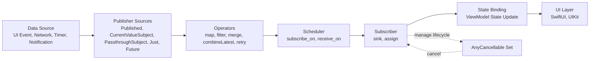
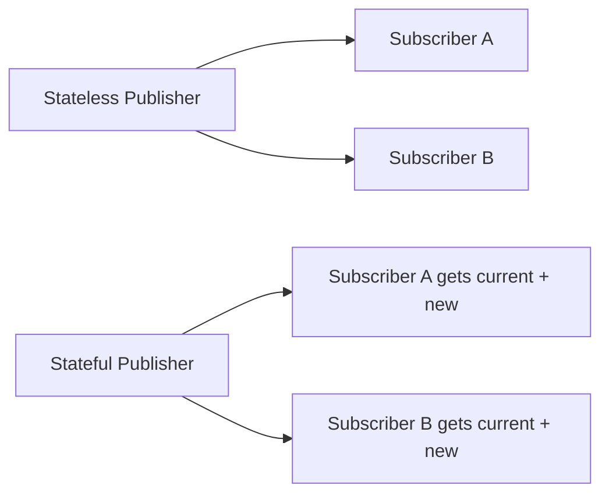
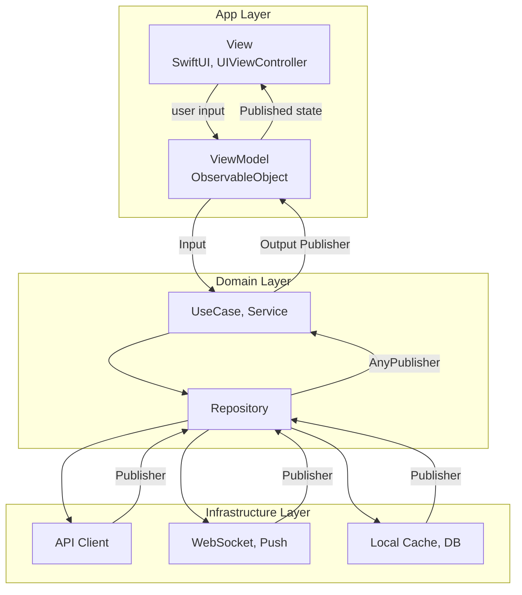
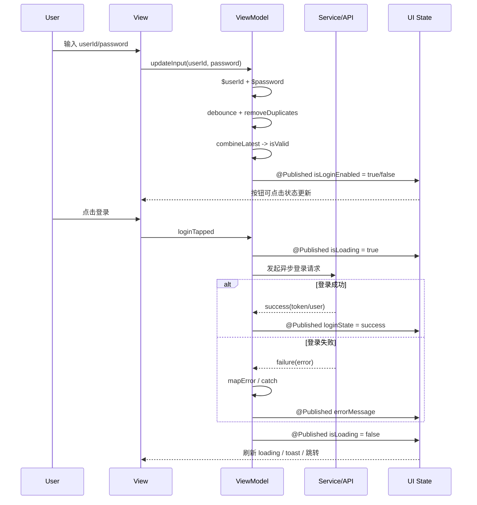

# iOS Combine 架构与接口指南（官方文档版）

本文基于 Apple 官方 Combine 文档进行整理，目标是从“架构视角 + 接口视角”快速建立完整认知，并可直接用于项目设计与面试表达。

官方参考：<https://developer.apple.com/documentation/combine>

## 1. Combine 的架构模型

Combine 的核心是“声明式数据流”：

- **Publisher（发布者）**：声明如何产生值和完成事件。
- **Subscriber（订阅者）**：消费发布者发出的值。
- **Subscription（订阅关系）**：连接 Publisher 与 Subscriber，并负责需求请求与取消。
- **Operator（操作符）**：在 Publisher 链路中转换、过滤、组合、调度事件。
- **Cancellable（可取消对象）**：用于管理订阅生命周期，典型是 `AnyCancellable`。

一句话理解：**Publisher 负责生产，Subscriber 负责消费，Operator 负责加工，Subscription/Cancellable 负责生命周期与流量控制。**

### 1.1 架构图（Architecture Diagram）



### 1.2 结构图（Structure Diagram）

### 1.1.1 无状态 vs 有状态 Publisher（极简对照图）



### 1.1.2 在 Combine 中如何体现“有状态/无状态”

判断标准很简单：**新订阅者是否会立即收到当前值**。

- **无状态（Stateless）**
  - 不持有当前值，只转发订阅之后的新事件
  - 新订阅者不会自动获得“历史/当前状态”
  - 典型：`PassthroughSubject`
- **有状态（Stateful）**
  - 持有当前值，并在新订阅建立时先回放当前值
  - 然后继续发送后续变化
  - 典型：`CurrentValueSubject`、`@Published`（在 `ObservableObject` 中）

快速选型：

- 只关心“事件发生了”（如 toast、埋点、一次性通知）-> 无状态
- 需要“随时知道当前状态”（如按钮可用性、loading、当前用户信息）-> 有状态

补充：`Just` 会发送一个值，但它更偏一次性值发布，不属于长期维护可变状态的状态容器语义。



### 1.3 时序图（Sequence Diagram）

下面以“登录表单实时校验 + 点击登录请求”为例，展示 Combine 在输入、防抖、组合、异步请求和 UI 回写上的完整时序。



## 2. 事件协议与背压机制

### 2.1 事件类型

Combine 流由三类事件组成：

- `value`：正常数据事件
- `completion(.finished)`：正常结束
- `completion(.failure(Error))`：错误结束（仅 `Failure != Never`）

### 2.2 背压（Demand）

Subscriber 可以通过 demand（需求）告诉上游“我还想要多少数据”，这是 Combine 与很多简单回调流的关键差异。  
在高频数据场景（消息流、传感器流）中，背压机制能帮助避免下游处理被压垮。

## 3. 核心协议与基础类型

## 3.1 Publisher

```swift
public protocol Publisher {
    associatedtype Output
    associatedtype Failure : Error
    func receive<S>(subscriber: S) where S : Subscriber, Self.Failure == S.Failure, Self.Output == S.Input
}
```

关键点：

- `Output` 定义输出值类型
- `Failure` 定义错误类型（可为 `Never`）
- 几乎所有操作符都返回新的 Publisher，实现链式组合

### 3.2 Subscriber

Subscriber 定义接收订阅、值和完成事件的能力，典型实现包括：

- `sink(receiveCompletion:receiveValue:)`
- `assign(to:on:)`

### 3.3 Subject

Subject 既是 Publisher，也是“可手动发送事件”的入口：

- `PassthroughSubject<Output, Failure>`：不保存最近值，适合纯事件广播
- `CurrentValueSubject<Output, Failure>`：持有当前值，新订阅者可立即收到

### 3.4 Cancellable / AnyCancellable

- `cancel()` 可主动终止订阅
- `AnyCancellable` 常用于“类型擦除 + 自动释放即取消”
- 实战常将多个订阅存入 `Set<AnyCancellable>`

## 4. 常用接口分层（按工程用途）

### 4.1 创建类 Publisher

- `Just`：立即发送一个值后结束
- `Empty`：不发送值，直接结束
- `Fail`：立即失败
- `Deferred`：延迟创建真实 Publisher
- `Future`：桥接一次性异步任务结果

适合用于：mock、默认分支、一次性异步封装。

### 4.2 转换类操作符

- `map` / `tryMap`
- `flatMap`
- `scan`
- `replaceNil`
- `eraseToAnyPublisher`

适合用于：数据模型映射、异步链拼接、隐藏内部实现类型。

### 4.3 过滤与节流类操作符

- `filter`
- `removeDuplicates`
- `compactMap`
- `debounce`
- `throttle`

适合用于：输入框防抖、状态去重、高频事件降噪。

### 4.4 组合类操作符

- `merge`：合并同类型多路流
- `zip`：按配对节奏输出
- `combineLatest`：任一路更新就组合输出最新值

适合用于：多输入校验、跨模块状态聚合、事件源统一。

### 4.5 错误处理类操作符

- `catch`
- `mapError`
- `retry`
- `replaceError(with:)`

适合用于：降级策略、统一错误语义、瞬时失败重试。

### 4.6 线程与调度类操作符

- `subscribe(on:)`：影响上游订阅/生产所在线程
- `receive(on:)`：影响下游消费回调所在线程

实践原则：UI 更新最终落主线程，计算与 I/O 尽量在后台执行。

## 5. 与 SwiftUI / MVVM 的典型接口组合

### 5.1 ObservableObject + @Published

在 ViewModel 中通过 `@Published` 暴露状态，SwiftUI 视图自动响应变化，是最常见组合。

### 5.2 输入输出（Input/Output）模式

可将 ViewModel 设计为：

- Input：用户动作（点击、输入、刷新）
- Output：可订阅状态（loading、列表、错误、按钮可用性）

这种模式便于测试与解耦，也方便跨页面复用。

### 5.3 AnyPublisher 作为模块边界

对外暴露 `AnyPublisher<Output, Failure>`，隐藏内部操作符细节，可降低调用方耦合并保留实现演进空间。

## 6. 生命周期与内存管理

高频问题与建议：

- 订阅必须被持有，否则会立即取消
- `sink` 闭包中注意 `[weak self]` 以避免循环引用
- 页面离开或上下文切换时及时取消不再需要的订阅
- 长链路需要明确“谁创建、谁持有、谁释放”

## 7. 架构实践建议（可直接落地）

- **单向数据流**：输入事件 -> 状态变换 -> 输出状态，减少隐式副作用。
- **状态集中管理**：同一业务状态尽量只保留一个“可信来源”。
- **接口类型擦除**：跨模块边界优先返回 `AnyPublisher`。
- **线程边界明确**：在接口层约定哪些输出保证主线程。
- **错误语义统一**：先在领域层归一化错误，再给 UI 层消费。
- **可测试优先**：复杂链路拆成可单测的小 Publisher 组合。

## 8. 常见接口速查（面试/开发）

- 订阅：
  - `sink(receiveCompletion:receiveValue:)`
  - `assign(to:on:)`
- 共享与多播：
  - `share()`
  - `multicast(_:)`
- 调试：
  - `print(_:)`
  - `handleEvents(...)`
- 时间相关：
  - `debounce(for:scheduler:)`
  - `throttle(for:scheduler:latest:)`
  - `timeout(_:scheduler:options:customError:)`

## 9. 易错点清单

- 把 `zip` 当成 `combineLatest` 使用，导致事件触发节奏不符合预期
- 忽略 `receive(on:)`，在非主线程更新 UI
- 订阅未持有，造成“代码看起来正确但不回调”
- 过度在视图层拼接复杂链路，导致难以测试和维护
- 未做类型擦除，模块暴露了过多内部细节类型

## 10. 结语

Combine 的价值不止于 API 熟练度，更在于通过“声明式数据流”提升架构清晰度：  
**把状态变化显式化，把副作用边界化，把生命周期可控化。**  
在中大型 iOS 项目中，这三点通常比“会不会某个操作符”更关键。

## 11. 这个框架的设计思维（为什么这么设计）

### 11.1 从“回调驱动”转向“状态驱动”

传统写法常以回调为中心，逻辑分散在事件处理器中，时间一长会出现：

- 状态来源不唯一（按钮状态、加载状态、错误状态散落多处）
- 副作用难追踪（同一动作触发多次请求）
- 难测试（只能端到端点点点）

Combine 的设计思维是：**把业务抽象成可组合的状态流**。  
UI 只是状态的投影，状态变化由流表达，副作用由边界隔离。

### 11.2 单向数据流：降低复杂度的第一原则

建议始终遵循：

- Input（用户/系统事件）-> Transform（操作符和业务规则）-> Output（UI 状态）

价值在于：

- 数据路径可视化，排查问题有“固定路线”
- 任何状态都可追溯到输入和规则
- 便于插入日志、监控、测试桩

### 11.3 边界思维：模块间传“能力”，不传“实现”

通过 `AnyPublisher` 暴露模块接口，本质是在做两件事：

- 只暴露契约（Output/Failure），隐藏内部链路
- 保留实现自由（内部可以重构操作符，不影响调用方）

这是一种“稳定外部，演进内部”的接口设计策略，特别适合中大型团队协作。

### 11.4 状态思维：单一可信来源（Single Source of Truth）

同一业务状态尽量只有一个来源，例如登录页的：

- `isLoading`
- `isLoginEnabled`
- `errorMessage`

都应由 ViewModel 统一产出，而不是在 View、Service、Coordinator 各写一份。  
这样可以显著降低状态错乱和竞态覆盖。

### 11.5 错误思维：先归一化，再展示

错误处理不要直接在 UI 层判断底层错误码。推荐路径：

- Infra 层错误（网络、解码、超时）
- Domain 层统一成业务错误语义（如 `invalidCredential`）
- UI 层只关心展示策略（toast、inline error、retry）

这样可以减少 `if code == xxx` 在页面中蔓延。

### 11.6 线程思维：上游并发，下游收敛

实践上可采用：

- 上游（请求、解析、计算）放后台
- 下游（UI 绑定）统一 `receive(on: main)`

核心不是“全主线程”或“全后台”，而是**在边界处统一线程语义**，避免隐式线程切换造成偶发问题。

### 11.7 生命周期思维：订阅是资源，不是语法

每个订阅都对应资源占用与事件通道，应明确：

- 谁创建（ViewModel/Service）
- 谁持有（`Set<AnyCancellable>`）
- 何时释放（deinit / 场景退出 / 手动 cancel）

这能避免“幽灵订阅”和重复回调问题。

### 11.8 测试思维：先拆流，再测流

把复杂链路拆成小的可验证单元：

- 输入 given（某些输入序列）
- 断言 then（期望输出序列）
- 覆盖取消、重试、超时、错误分支

可测试性是架构质量的结果，不是补丁。

## 12. 结合三张图的设计思维（落地版）

这一节把“图怎么画”变成“代码怎么落”，可以直接作为架构评审 checklist。

### 12.1 对应架构图：关注职责闭环，而非 API 堆砌

从左到右检查是否形成完整闭环：

- **数据源**是否清晰（用户输入、网络回包、定时器事件）
- **发布层**是否统一（避免同一事件有多处入口）
- **加工层**是否可读（操作符链不超过可维护复杂度）
- **消费层**是否单一（谁最终写状态）
- **生命周期层**是否可控（取消时机是否明确）

评审口径：如果某个节点可以被删除却不影响业务，说明架构里有冗余层。

### 12.2 对应结构图：分层的目标是“降低变更扩散”

分层不是为了好看，而是为了控制需求变更时的影响面：

- 改接口字段时，优先只影响 Infra + Repository
- 改业务规则时，优先只影响 UseCase / ViewModel
- 改交互样式时，优先只影响 View 层

当一次小需求要改 4 层以上，通常意味着边界不清或职责穿透。

### 12.3 对应时序图：先定义状态机，再写操作符链

建议先写状态转移，再写实现：

- `idle -> validating -> ready`
- `ready -> loading -> success/failure`

有了状态机，才去选择 `debounce`、`combineLatest`、`catch`、`retry`。  
这样可以避免“先写一串操作符，后面再猜行为”的反模式。

### 12.4 取舍思维：复杂度预算要前置

每条流都要评估复杂度预算：

- 操作符层数是否过深（可读性下降）
- 是否存在多路流互相回写（易造成环路）
- 是否过早抽象（为未来设计过多泛化接口）

工程建议：复杂链路拆成具名中间 Publisher，保留语义名称，减少一行到底的链式拼接。

### 12.5 协作思维：把“规范”固化到接口约定

团队协作中，建议提前约定：

- 跨模块统一返回 `AnyPublisher`
- UI 层状态输出统一主线程语义
- 错误类型统一映射到领域错误枚举
- 订阅持有与释放遵循统一模板

这样新人接入时，不需要理解全部上下文，也能按约定安全扩展。

### 12.6 演进思维：允许重构链路，不破坏契约

Combine 架构应支持“内部可重构、外部无感知”：

- 内部可从 `flatMap` 重构为 `switchToLatest`
- 可替换重试策略和缓存策略
- 可调整调度策略以优化性能

前提是：对外契约（Output/Failure/线程语义）稳定。  
这就是“面向演进设计”的核心。
