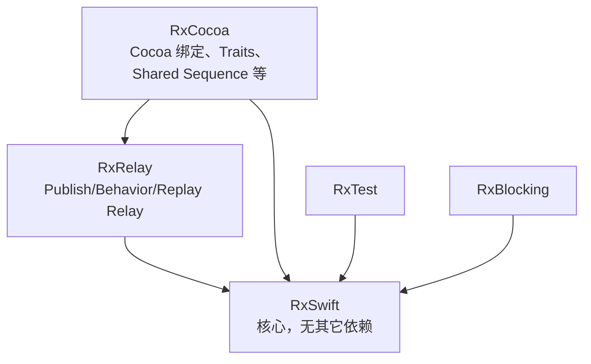

# RxSwift 架构与核心设计思维（基于 ReactiveX/RxSwift 仓库）

本文依据开源仓库 [ReactiveX/RxSwift](https://github.com/ReactiveX/RxSwift) 的公开说明（以 `README.md` 与官方 `Documentation` 为主线），说明 **仓库自身的模块架构**、**核心概念**，以及 **Reactive Extensions 在 Swift 里要解决的问题与设计取舍**。更偏「理解框架」而非刷题；面试速记可配合同目录下的 `ios-rxswift-interview-questions.md`。

交叉文档：[ReactiveX.io](http://reactivex.io/) · [RxSwift Getting Started](https://github.com/ReactiveX/RxSwift/blob/main/Documentation/GettingStarted.md)

## 1. 仓库在解决什么问题

官方表述可以压缩成三句话：

1. **Rx** 是通过 `Observable`（可观察序列）表达的、对「计算过程」的泛化抽象：你可以向流 **广播** 事件，也可以 **订阅** 事件。
2. **RxSwift** 是 [Reactive Extensions](http://reactivex.io) 在 Swift 上的实现；在保持 Rx 精神与命名习惯的前提下，提供 **Swift 优先** 的 API 形态。
3. 与其它 Rx 实现一致，目标是让 **异步操作** 与 **数据流** 以 `Observable` 为载体，通过一套 **可组合的操作符** 拼出复杂行为。

由此衍生出 RxSwift 在架构上最鲜明的一点：**把 KVO、异步任务、UI 事件、推送数据等，都统一成「序列」这一种抽象**。README 里写得很直白：多种来源的数据流被统一到 sequence 之下，这是 Rx 显得简单、优雅且可组合的原因。

## 2. 仓库模块架构（多 Target 依赖关系）

README 用一张 ASCII 图说明了五个可独立依赖的组件及其依赖方向（此处用 Mermaid 等价表达，语义与官方图一致）。

### 2.1 各模块职责（与官方 README 对齐）

| 模块 | 职责摘要 | 依赖 |
|------|-----------|------|
| **RxSwift** | ReactiveX 标准在 Swift 中的主体实现（`Observable`、操作符、`Scheduler`、`Disposable` 等）；**不引入外部依赖**。 | 无 |
| **RxRelay** | 对 Subject 的轻量封装：`PublishRelay`、`BehaviorRelay`、`ReplayRelay`；**不向外发送 `Error` 完成事件**（适合 UI/状态桥接，详见 [Subjects / Relays](https://github.com/ReactiveX/RxSwift/blob/main/Documentation/Subjects.md#relays)）。 | RxSwift |
| **RxCocoa** | iOS / macOS / watchOS / tvOS 等 Cocoa 能力：如 **Shared Sequence**、**Traits**、控件 `rx` 扩展等；**依赖 RxSwift + RxRelay**。 | RxSwift、RxRelay |
| **RxTest** | 基于虚拟时间的可测试基础设施（如 `TestScheduler`），用于编排事件与断言。 | RxSwift |
| **RxBlocking** | 在测试或特殊场景下 **阻塞式** 消费序列（与主应用异步风格相反，慎用）。 | RxSwift |

**架构启示**：业务与领域层尽量只依赖 **RxSwift**（必要时 **RxRelay**）；**RxCocoa** 贴近 UIKit/AppKit，宜留在展示层或薄绑定层，避免把 Cocoa 扩展泄漏进纯 Swift 模块，以保持依赖方向清晰。

仓库内还有 **RxExample**、**Rx.playground**、**Documentation** 等，用于示例与文档，不属于你 App 运行时的必选依赖。

## 3. 核心概念（从「协议图」到日常用语）

### 3.1 Observable（序列）

- **Observable\<Element\>**：描述「未来可能推送的多个或零个 `Element`，并以 completed 或 error 结束」的生产端抽象。
- 订阅发生前，许多工厂方法创建的流是 **惰性的（cold）**：每次新订阅可能触发一整套副作用；这与 **热序列（hot）** 相对。官方专题：[Hot and Cold Observables](https://github.com/ReactiveX/RxSwift/blob/main/Documentation/HotAndColdObservables.md)。

理解冷热对流是架构级决策：**谁持有生产者、谁在何时订阅、副作用执行几次**，直接决定是否重复请求、是否要多播（`share` 等）。

### 3.2 Observer 与事件

订阅端消费的是 **事件**：`next`、`error`、`completed`。架构上应约定：**error 是流的一种结束方式**；若希望 UI 侧「永不出错流」，会走向 **Traits** 或 **Relay**，而不是到处 `catch` 吞掉语义。

### 3.3 操作符（组合与变换）

操作符是 Rx 的核心工程能力：**用声明式组合代替嵌套回调**。README 中的 GitHub 搜索示例（`throttle`、`distinctUntilChanged`、`flatMapLatest`、`catchAndReturn`、`observe(on:)`）展示的是典型 **输入节流 → 取消陈旧请求 → 错误降级 → 主线程消费** 的完整链路，这也是在 UI 架构里反复出现的模式。

官方入门：[Getting Started](https://github.com/ReactiveX/RxSwift/blob/main/Documentation/GettingStarted.md)

### 3.4 Scheduler（调度）

Scheduler 回答的是 **「这段逻辑在哪个执行上下文跑」**，与 UI 正确性、性能、测试可重复性都相关。架构上要固定团队约定：例如 **UI 绑定最终落主线程**，耗时工作在后台 Scheduler，测试用 `TestScheduler` 推进虚拟时间（见 [UnitTests](https://github.com/ReactiveX/RxSwift/blob/main/Documentation/UnitTests.md)）。

### 3.5 Disposable 与生命周期

订阅返回 **Disposable**；常见模式是 `disposed(by: disposeBag)`，让生命周期与 ViewController / ViewModel 一致。架构含义：**订阅是一种资源**，必须和界面或作用域绑定释放，否则会有泄漏、重复回调或「页面已销毁仍更新 UI」类问题。官方提示与常见错误：[Tips](https://github.com/ReactiveX/RxSwift/blob/main/Documentation/Tips.md)。

### 3.6 Subject 与 Relay

- **Subject**：既是观察者也是被观察者，适合 **命令式** 向流里塞事件。
- **Relay**（RxRelay）：在 Subject 基础上约束 **不通过 `onError`/`onCompleted` 终止**（完成语义更贴近 UI 状态通道），与 RxCocoa 一起构成 UI 层常用的「无 Error 管道」。

## 4. Traits 与设计意图（为什么不止 Observable）

官方单独文档 [Traits](https://github.com/ReactiveX/RxSwift/blob/main/Documentation/Traits.md) 说明：`Single`、`Completable`、`Maybe`、`Driver`、`ControlProperty` 等是在 **类型层面** 压缩状态空间，让调用方在编译期或 API 合同上就知道：

- 事件个数（例如网络一次回包更像 `Single`）
- 是否允许 `error` 出现在 UI 绑定链上（`Driver` 等约定）
- 观察是否必须在主线程等

**设计思维**：通用 `Observable` 表达能力最强，但合同最弱；Traits 用 **更弱的表达能力** 换取 **更强的局部正确性** 与 **更可读的模块边界**。这与 Swift 的类型文化是一致的。

## 5. 设计思维归纳（从仓库目标反推工程原则）

### 5.1 统一抽象：一切皆是序列

把异构来源统一为 Observable，是为了 **跨层组合**：网络、定时器、手势、属性变化可以用同一套操作符语言连接。架构代价是团队必须掌握 **冷热、多播、共享副作用** 等概念，否则会出现「多订一次就多跑一次请求」类问题。

### 5.2 组合优于继承：流即程序结构

README 强调 RxSwift「与它所驱动的异步工作一样具有组合性」。在应用架构里对应的是：**用小的、可测试的流拼页面与用例**，而不是在 ViewController 里堆叠分支回调。

### 5.3 与平台解耦：核心无依赖，Cocoa 外置

RxSwift 核心 **零外部依赖**，平台相关能力集中在 RxCocoa。这是刻意分层：**领域与数据层可以不 import UIKit**，测试与 SPM 集成也更干净（安装方式见仓库 [README Installation](https://github.com/ReactiveX/RxSwift/blob/main/README.md#installation)）。

### 5.4 Swift-first 与 Rx 标准之间的张力

仓库声明在遵循 ReactiveX 精神的同时提供 Swift 习惯的 API。工程上应接受：**既有与 ReactiveX 其它语言一致的通用模式，也有 Swift/iOS 专用的 Traits 与绑定**。学习路径建议：**ReactiveX 通用操作符 + RxSwift 文档中的 Swift 特化章节** 并行阅读。

### 5.5 可观测性与可测试性是一等需求

RxTest / RxBlocking 与官方测试文档表明：**可测试性** 是 Rx 体系的一部分，而不是事后补丁。架构上应为关键用例保留 **可注入的 Scheduler** 与 **可替换的数据源**，以便在 `TestScheduler` 下复现竞态与时间相关行为。

## 6. 在 App 中的推荐分层（与仓库模块对应）

下表是常见映射，便于评审依赖是否「穿层」：

| App 层 | 推荐依赖 | 说明 |
|--------|-----------|------|
| View / ViewController | RxCocoa、RxRelay、RxSwift | 绑定控件、`Driver`、Relay 出口 |
| ViewModel / Presenter | RxSwift、RxRelay | 编排用例、暴露 `Driver`/`Observable` 输出 |
| Domain / UseCase | 通常仅 RxSwift（或甚至无 Rx） | 保持平台无关；必要时返回 Observable |
| Data / Repository | RxSwift | 网络与存储适配为流 |
| 单元测试 | RxTest（+ RxSwift） | 虚拟时间、事件表驱动断言 |

原则：**RxCocoa 不向下穿透**；需要给 UI 的「无 Error、主线程」语义，在 ViewModel 边界用 `asDriver` 等收敛。

## 7. 官方文档索引（建议按序阅读）

仓库 `README` 的「I came here because I want to ... understand」一节已给出路线图，此处摘录为学习顺序：

1. [Why use Rx?](https://github.com/ReactiveX/RxSwift/blob/main/Documentation/Why.md)
2. [Getting Started](https://github.com/ReactiveX/RxSwift/blob/main/Documentation/GettingStarted.md)
3. [Traits](https://github.com/ReactiveX/RxSwift/blob/main/Documentation/Traits.md)
4. [UnitTests](https://github.com/ReactiveX/RxSwift/blob/main/Documentation/UnitTests.md)
5. [Tips](https://github.com/ReactiveX/RxSwift/blob/main/Documentation/Tips.md)
6. [Hot and Cold Observables](https://github.com/ReactiveX/RxSwift/blob/main/Documentation/HotAndColdObservables.md)
7. 与其它库对比：[ComparisonWithOtherLibraries](https://github.com/ReactiveX/RxSwift/blob/main/Documentation/ComparisonWithOtherLibraries.md)

数学与对偶视角（ Iterator / Observer 对偶）见仓库引用的 [MathBehindRx](https://github.com/ReactiveX/RxSwift/blob/main/Documentation/MathBehindRx.md) 与外部论文链接。

## 8. 结语

**RxSwift 仓库层面的架构**可以概括为：以 **无依赖的 RxSwift 核心** 实现 ReactiveX 标准，用 **RxRelay** 约束 UI 友好语义，用 **RxCocoa** 承接 Apple 平台绑定与 Traits，用 **RxTest/RxBlocking** 支撑可验证的组合逻辑。**设计思维**则是：用 **序列** 统一异步与事件，用 **操作符** 表达组合，用 **模块边界与 Traits** 在 Swift 工程里换取类型安全与可维护性。

若你只希望保留一篇「从官方仓库出发」的 Rx 架构说明，本文可作为主文档；具体面试问答仍建议拆读 `ios-rxswift-interview-questions.md`。
