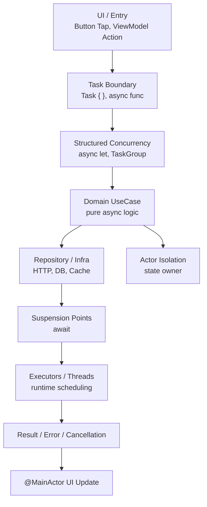
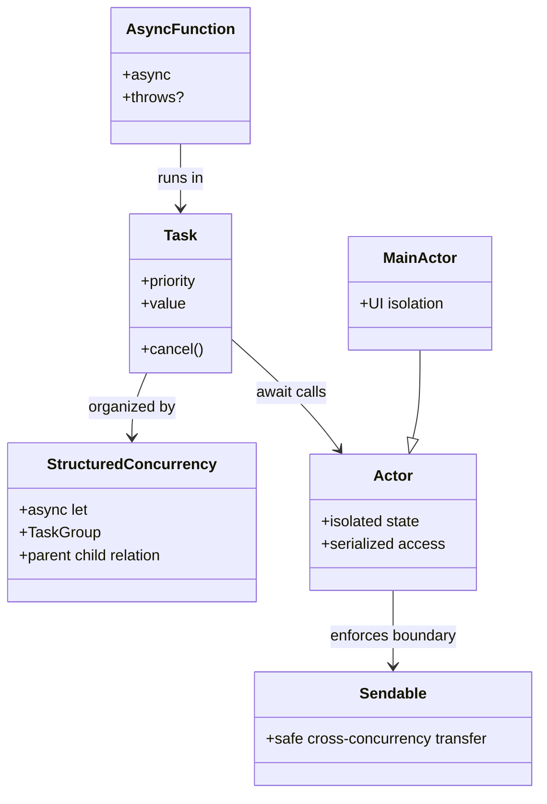
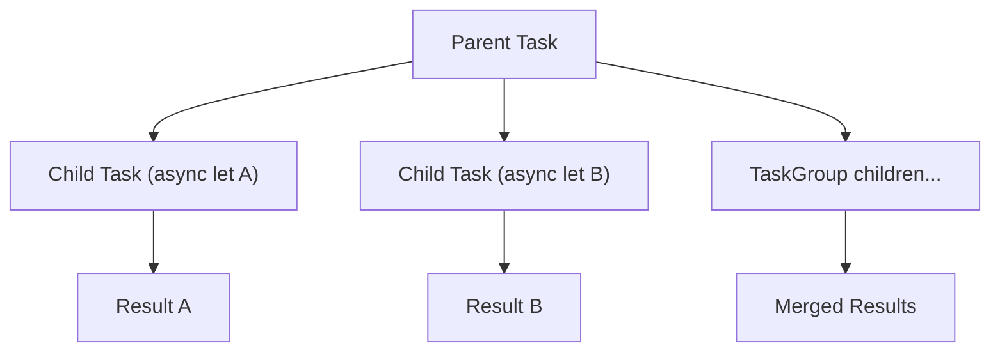
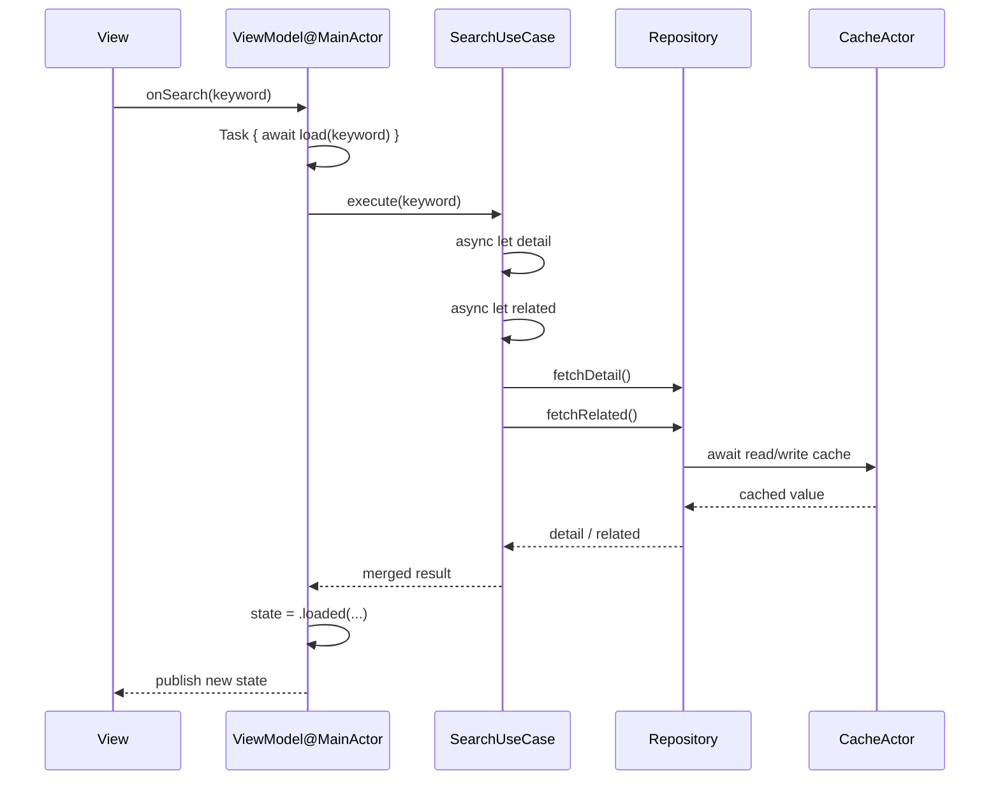

# Swift Concurrency 架构与结构指南（async/await + Task + Actor）

本文面向 iOS 工程与面试表达，聚焦 Swift 原生并发（Swift 5.5+）的**架构模型**与**结构设计**：不是只记 API，而是理解“任务如何组织、状态如何隔离、线程如何切换、错误与取消如何传播”。

官方参考：

- <https://developer.apple.com/documentation/swift/concurrency>
- <https://docs.swift.org/swift-book/documentation/the-swi
ft-programming-language/concurrency/>

## 1. Swift Concurrency 在解决什么问题

Swift 并发的目标可以压缩为三点：

1. 用 `async/await` 让异步代码可读、可维护（替代回调地狱）。
2. 用 Structured Concurrency 让任务生命周期可控（父子任务自动管理）。
3. 用 `actor` 与 `Sendable` 在语言层阻止数据竞争（data race）。

一句话理解：**Swift 并发 = 可读的异步语法 + 可控的任务树 + 内建的数据隔离模型**。

## 2. 架构总览（Architecture Diagram）

这张图表达两条主线：

- **控制线**：入口创建任务 -> 任务树执行 -> 返回结果/错误/取消。
- **安全线**：共享状态进入 `actor` 隔离区，通过 `await` 异步访问。

## 3. 结构模型（Structure Diagram）

### 3.1 核心构件关系

### 3.2 任务树（Task Tree）与生命周期

核心语义：

- 父任务等待子任务完成后才结束（结构化作用域）。
- 父任务取消时，子任务收到取消信号（协作式取消）。
- 子任务抛错会沿任务树向上传播（取决于调用点如何处理）。

## 4. 关键机制拆解

### 4.1 `async/await`：挂起而非阻塞

- `await` 是**潜在挂起点**，不是线程阻塞点。
- 任务在挂起期间，线程可去执行其他任务。
- 恢复后继续从挂起点后执行，逻辑更接近同步代码。

### 4.2 Structured Concurrency：默认做“对的事”

- `async let`：适合“数量已知”的并行任务。
- `withTaskGroup`：适合“数量动态”的并行任务。
- 不鼓励随意漂浮的后台任务，避免生命周期泄漏。

### 4.3 `Task`：并发工作的执行实体

- `Task {}`：继承当前上下文（优先级、actor 语义等）。
- `Task.detached {}`：脱离上下文，只有在明确需要边界隔离时使用。
- `Task.cancel()` 只是发出取消请求，任务内部要检查并响应。

### 4.4 `Actor`：共享可变状态的默认归宿

- `actor` 内部状态只允许受控访问，避免并发写冲突。
- 跨 actor 调用需要 `await`，因为可能排队等待执行。
- `@MainActor` 是 UI 状态隔离，保证 UI 更新语义在主执行上下文。

### 4.5 `Sendable`：跨并发边界的数据契约

- `Sendable` 表示类型可安全跨任务/actor 传递。
- 值类型通常更容易满足；引用类型要额外保证线程安全。
- 在严格并发检查下，编译器会提示潜在不安全传递。

## 5. 执行时序（Sequence Diagram）

下面以“搜索页面输入 -> 并发请求详情与推荐 -> UI 合并展示”为例：

设计重点：

- ViewModel 作为 UI 边界可标注 `@MainActor`。
- UseCase 做并行编排（`async let` / `TaskGroup`）。
- 共享缓存放进 `actor`，而不是分散加锁。

## 6. 工程分层建议（iOS 实战）

| 层级 | 并发职责 | 建议 |
|------|----------|------|
| View / ViewController / SwiftUI View | 触发异步动作、渲染状态 | 不承载复杂并发编排，交给 ViewModel |
| ViewModel（常用 `@MainActor`） | 启动任务、管理页面状态、取消旧任务 | 只保留页面级任务与状态机 |
| UseCase / Service | 编排并发流程、聚合多个数据源 | 优先用 Structured Concurrency |
| Repository | IO 适配（网络、数据库、文件） | 提供 `async throws` 接口 |
| Actor（Cache/Session/Token） | 持有共享可变状态 | 作为状态所有者，外部只走异步接口 |

一条经验：**“并发编排放 UseCase，状态隔离进 Actor，UI 收敛到 MainActor。”**

## 7. 常见误区与修正

1. **误区：`await` 会阻塞线程**  
   修正：`await` 是任务挂起，不是线程阻塞。

2. **误区：`Task.detached` 到处可用**  
   修正：优先 `Task {}` 和结构化并发；`detached` 只在明确脱离上下文时用。

3. **误区：有了 actor 就完全没有竞态**  
   修正：仍要关注 actor reentrancy（重入）导致的逻辑时序问题。

4. **误区：调用 `cancel()` 就一定立刻停止**  
   修正：Swift 是协作式取消，需要任务主动检查取消状态。

5. **误区：所有代码都该标 `@MainActor`**  
   修正：只给 UI 相关状态与方法标注，避免把重任务绑到主执行上下文。

## 8. 面试表达模板（60 秒）

“Swift 并发模型由 `async/await`、`Task`、`Structured Concurrency` 和 `Actor` 组成。`async/await` 解决可读性，Structured Concurrency 解决任务生命周期和错误/取消传播，Actor 解决共享可变状态的数据竞争。工程上我会把 UI 状态放 `@MainActor` ViewModel，并发编排放 UseCase，共享缓存和会话状态放 Actor，Repository 提供 `async throws` IO 接口，整体形成可测试、可取消、可隔离的并发架构。”

## 9. 结语

Swift Concurrency 的价值不止是“语法更好看”，而是把并发正确性前置到了语言和类型系统：**任务结构化、状态隔离化、跨边界可验证化**。这三点决定了它在中大型 iOS 项目中的可维护性上限。
