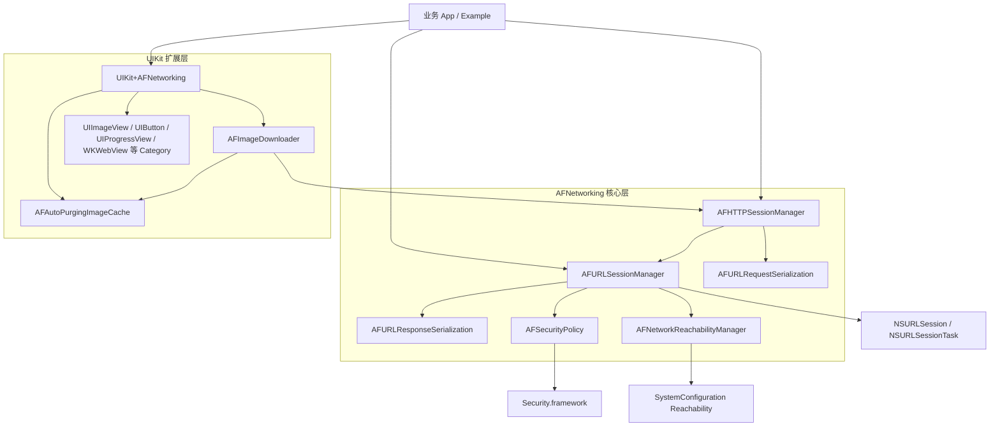
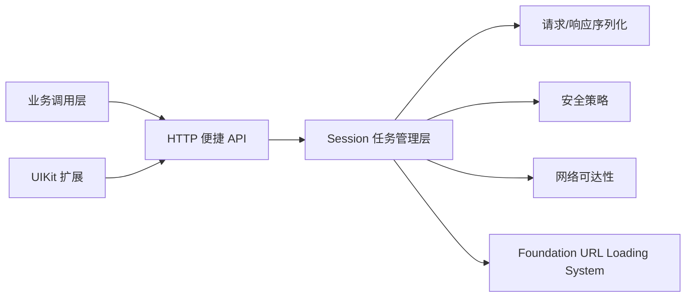

# AFNetworking 架构说明

## 1. 项目定位

AFNetworking 是一个面向 Apple 平台的 Objective-C 网络库，构建在 Foundation URL Loading System 之上。它的核心目标是将 `NSURLSession` 的任务管理、HTTP 请求构造、参数编码、响应解析、HTTPS 安全校验、网络可达性监听以及 UIKit 网络图片加载等常见能力封装成稳定的高层 API。

当前仓库版本为 `4.0.1`，README 已声明项目自 2023 年起停止维护并进入归档状态。现代 Swift 项目建议迁移到 Alamofire。

## 2. 架构总览

## 3. 核心模块

### 3.1 `AFURLSessionManager`

`AFURLSessionManager` 是核心会话管理层，负责创建和持有 `NSURLSession`，并实现 `NSURLSessionDelegate`、`NSURLSessionTaskDelegate`、`NSURLSessionDataDelegate`、`NSURLSessionDownloadDelegate`。

主要职责：

- 创建 data、upload、download task。
- 维护当前 session 下的任务集合。
- 统一管理上传、下载进度回调。
- 在任务完成后调用 `responseSerializer` 做响应校验和反序列化。
- 通过 `securityPolicy` 处理 HTTPS trust challenge。
- 在非 watchOS 平台关联 `AFNetworkReachabilityManager`。
- 支持自定义 completion queue 和 dispatch group。

### 3.2 `AFHTTPSessionManager`

`AFHTTPSessionManager` 继承自 `AFURLSessionManager`，是面向 HTTP API 的高级封装。

主要职责：

- 管理 `baseURL`。
- 通过 `requestSerializer` 构造请求 URL、请求头、请求体。
- 提供 `GET`、`HEAD`、`POST`、`PUT`、`PATCH`、`DELETE` 等便捷方法。
- 支持 multipart form-data 上传。
- 默认使用 `AFHTTPRequestSerializer` 和 `AFJSONResponseSerializer`。

### 3.3 请求序列化

请求序列化由 `AFURLRequestSerialization` 协议和具体 serializer 实现。

主要类型：

- `AFHTTPRequestSerializer`：默认 HTTP serializer，处理 query string、URL form body、默认 header、Basic Auth、超时、缓存策略等。
- `AFJSONRequestSerializer`：将参数编码为 JSON body，并设置 JSON Content-Type。
- `AFPropertyListRequestSerializer`：将参数编码为 plist body。
- `AFMultipartFormData`：支持文件、data、stream 等 multipart body 构造。

### 3.4 响应序列化

响应序列化由 `AFURLResponseSerialization` 协议和具体 serializer 实现。

主要类型：

- `AFHTTPResponseSerializer`：基础 HTTP 响应校验，处理可接受状态码和 MIME type。
- `AFJSONResponseSerializer`：解析 JSON。
- `AFXMLParserResponseSerializer`：解析为 `NSXMLParser`。
- `AFXMLDocumentResponseSerializer`：macOS 下解析为 `NSXMLDocument`。
- `AFPropertyListResponseSerializer`：解析 plist。
- `AFImageResponseSerializer`：解析图片。
- `AFCompoundResponseSerializer`：组合多个 serializer，按顺序尝试解析。

### 3.5 `AFSecurityPolicy`

`AFSecurityPolicy` 负责 HTTPS 服务端证书信任评估。

主要能力：

- 默认策略：不允许无效证书，校验证书域名，不启用 pinning。
- 支持 `AFSSLPinningModeNone`、`AFSSLPinningModePublicKey`、`AFSSLPinningModeCertificate`。
- 支持从 bundle 加载 `.cer` 证书。
- 在 `NSURLSession` authentication challenge 中决定是否信任服务端证书链。

### 3.6 `AFNetworkReachabilityManager`

`AFNetworkReachabilityManager` 基于 `SystemConfiguration` 监听网络可达性。

主要能力：

- 支持默认地址、指定域名、指定 socket address 的可达性监听。
- 区分 `Unknown`、`NotReachable`、`ReachableViaWWAN`、`ReachableViaWiFi`。
- 通过 block 通知网络状态变化。

注意：它更适合解释失败原因或触发重试，不应作为阻止用户发起网络请求的唯一依据。

### 3.7 UIKit 扩展

`UIKit+AFNetworking` 是 iOS/tvOS 上的 UI 辅助层，不包含在 Swift Package 目标中。

主要能力：

- `AFImageDownloader`：基于 `AFHTTPSessionManager` 下载图片，支持并发队列、FIFO/LIFO 优先级、重复请求合并、取消 receipt。
- `AFAutoPurgingImageCache`：内存图片缓存，按最近访问时间自动清理。
- `UIImageView+AFNetworking`、`UIButton+AFNetworking`：异步设置远程图片。
- `UIProgressView+AFNetworking`、`UIActivityIndicatorView+AFNetworking`、`UIRefreshControl+AFNetworking`：绑定网络任务状态。
- `AFNetworkActivityIndicatorManager`：管理 iOS 状态栏网络活动指示器。
- `WKWebView+AFNetworking`：辅助 WebView 请求加载。

## 4. 分层关系

## 5. 设计特点

- 以 `NSURLSession` 为基础，而不是替换系统网络栈。
- 以协议隔离请求序列化和响应序列化，便于替换解析策略。
- 将 HTTP 便捷 API 与底层 session 管理分离，`AFHTTPSessionManager` 是 `AFURLSessionManager` 的专用子类。
- 将安全策略、网络状态、UI 扩展作为可组合能力，而不是写死在请求 API 中。
- 通过 CocoaPods subspec 拆分 `Serialization`、`Security`、`Reachability`、`NSURLSession`、`UIKit`。
