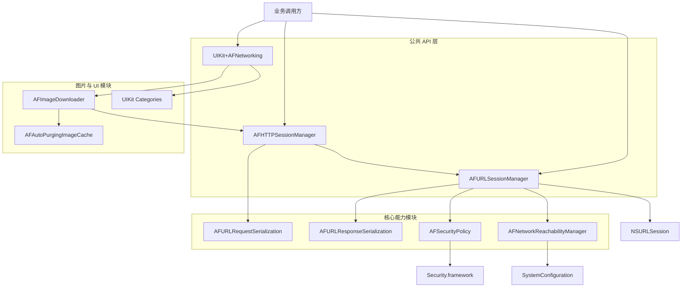
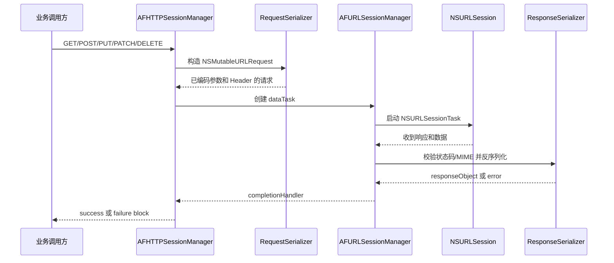
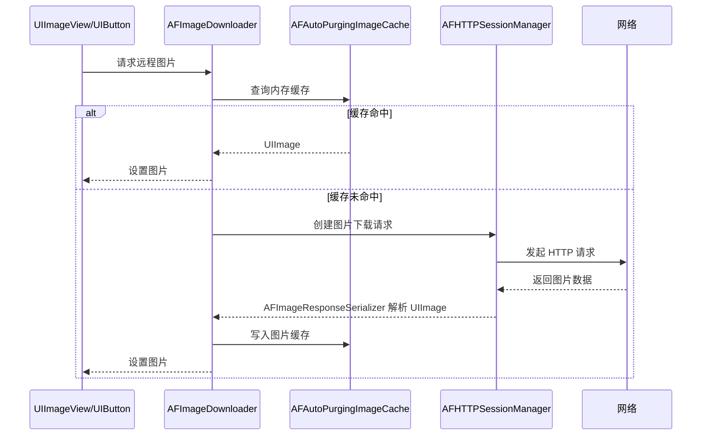
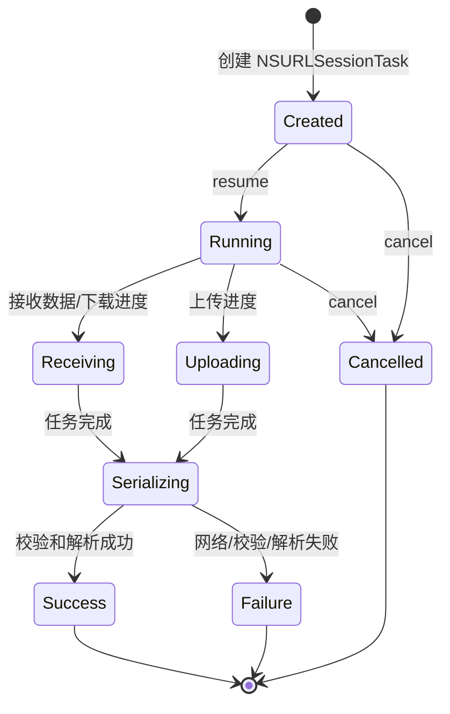
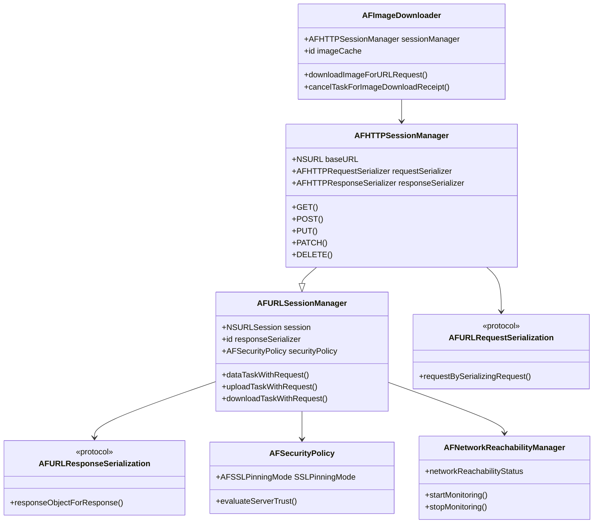

# 概要设计：AFNetworking

## 1. 设计概述

### 1.1 设计目标

AFNetworking 的目标是在 Apple 平台上提供一套高层、模块化、可组合的网络访问 API，降低直接使用 `NSURLSession`、请求参数编码、响应解析、HTTPS 证书校验、网络状态监听和 UIKit 网络图片加载的复杂度。

### 1.2 设计原则

- 基于系统网络栈：不重写底层网络能力，而是封装 `NSURLSession` 和 Foundation URL Loading System。
- 模块化：请求序列化、响应序列化、安全策略、可达性、UI 扩展相互独立。
- 可替换：通过协议抽象 serializer 和 cache，允许调用方替换实现。
- 平台适配：通过条件编译适配 iOS、macOS、watchOS、tvOS。
- 便捷优先：为常见 HTTP 方法、multipart 上传、图片下载提供简洁 API。

### 1.3 影响范围

该库影响应用的网络访问层，常作为业务 API client、图片加载组件、下载上传任务管理器和 HTTPS 安全策略配置入口。

## 2. 架构设计

### 2.1 模块依赖

- `AFHTTPSessionManager` 依赖 `AFURLSessionManager`，并额外依赖请求序列化能力。
- `AFURLSessionManager` 依赖响应序列化、安全策略和网络可达性。
- `AFImageDownloader` 依赖 `AFHTTPSessionManager` 和图片缓存协议。
- UIKit 分类依赖图片下载、任务状态观察和 UIKit 控件生命周期。

## 3. 数据流设计

### 3.1 HTTP 请求流程

### 3.2 图片加载流程

### 3.3 任务状态流转

## 4. 模块设计

### 4.1 会话管理模块

会话管理模块以 `AFURLSessionManager` 为中心，负责和 `NSURLSession` 交互。它将 delegate 回调转成 block 风格 API，并集中处理进度、完成回调、下载目标路径、后台 session 事件和 task 生命周期。

### 4.2 HTTP API 模块

HTTP API 模块由 `AFHTTPSessionManager` 提供。它通过 `baseURL` 和 path 构造请求 URL，委托 `requestSerializer` 编码参数，然后复用 `AFURLSessionManager` 的 task 创建能力执行请求。

### 4.3 序列化模块

请求序列化模块负责将业务参数转为 HTTP 请求结构；响应序列化模块负责将原始 `NSData` 转为业务可直接使用的对象。两者都通过协议抽象，使调用方可以自定义 serializer。

### 4.4 安全策略模块

安全策略模块封装证书链评估和 SSL Pinning。它在 HTTPS challenge 中被 session manager 调用，决定是否接受服务端 trust。

### 4.5 可达性模块

可达性模块封装 `SCNetworkReachability`，为应用提供网络状态观察能力。它不直接拦截请求，只提供状态信息和变化通知。

### 4.6 UIKit 模块

UIKit 模块通过 Objective-C Category 给 UIKit 控件增加网络能力。图片下载使用 `AFImageDownloader`，缓存使用 `AFAutoPurgingImageCache`，控件状态通过任务通知或 KVO 与网络任务绑定。

## 5. 接口设计

### 5.1 核心公开入口

- `AFNetworking.h`：核心库 umbrella header。
- `Framework/AFNetworking.h`：framework 形式使用时的 umbrella header，包含核心和 UIKit 扩展。
- `UIKit+AFNetworking.h`：UIKit 扩展入口。

### 5.2 常用调用入口

- `+[AFHTTPSessionManager manager]`
- `-initWithBaseURL:sessionConfiguration:`
- `-GET:parameters:headers:progress:success:failure:`
- `-POST:parameters:headers:progress:success:failure:`
- `-dataTaskWithRequest:uploadProgress:downloadProgress:completionHandler:`
- `-downloadTaskWithRequest:progress:destination:completionHandler:`
- `-uploadTaskWithRequest:fromFile:progress:completionHandler:`

### 5.3 扩展点

- 替换 `requestSerializer`。
- 替换 `responseSerializer`。
- 配置 `securityPolicy`。
- 配置 `reachabilityManager`。
- 替换 `AFImageDownloader` 的 `imageCache` 或 `sessionManager`。

## 6. 技术实现要点

- 使用 Objective-C 协议隔离请求和响应序列化。
- 使用 Category 扩展 UIKit 控件，保持核心网络层与 UI 层分离。
- 使用 `NSProgress` 暴露上传和下载进度。
- 使用 `NSSecureCoding` 和 `NSCopying` 支持 manager、serializer、security policy 的复制和归档场景。
- 使用 `TargetConditionals.h` 控制平台差异。
- 通过 CocoaPods subspec 支持按需引入模块。

## 7. 异常与边界处理

- 网络错误：由 `NSURLSessionTask` completion 中的 `NSError` 传递给 failure block。
- HTTP 状态码异常：由 `AFHTTPResponseSerializer` 根据 `acceptableStatusCodes` 校验。
- MIME type 不匹配：由 response serializer 根据 `acceptableContentTypes` 校验。
- 响应解析失败：由 JSON、XML、plist、image serializer 返回解析错误。
- HTTPS 信任失败：由 `AFSecurityPolicy` 在 trust evaluation 阶段拒绝。
- 图片重复请求：`AFImageDownloader` 合并相同请求的回调，避免重复下载。
- 图片缓存超限：`AFAutoPurgingImageCache` 根据最近访问时间清理旧图片。
- 平台缺失能力：通过条件编译排除不支持的模块，例如 watchOS 上的 reachability。

## 8. 验收标准对应

- 能通过 `AFHTTPSessionManager` 快速发起常见 HTTP 请求。
- 能将业务参数序列化为 query、form、JSON、plist 或 multipart body。
- 能将服务端响应解析为 JSON、XML、plist、image 或原始 data。
- 能配置 HTTPS 安全策略和 SSL Pinning。
- 能监听网络可达性状态变化。
- 能在 UIKit 控件中便捷加载远程图片并缓存。
- 能按平台和包管理器需求选择核心模块或 UIKit 扩展。
