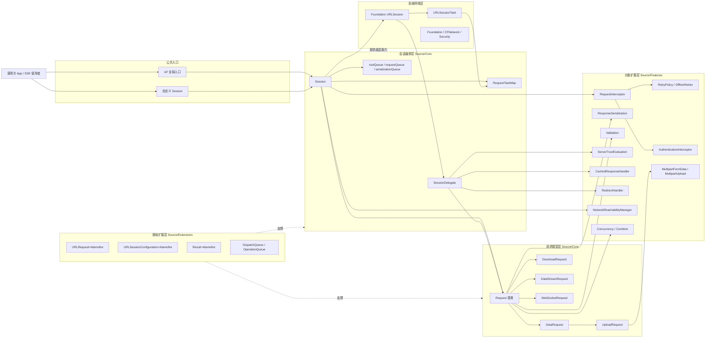
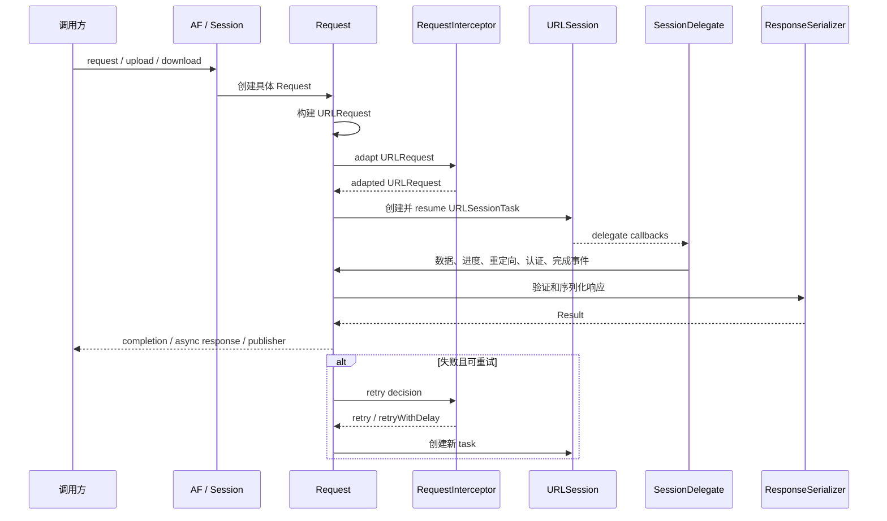

# Alamofire 项目架构

本文档基于当前仓库代码整理，描述 Alamofire 的整体架构、模块边界、核心调用链和主要扩展点。

## 1. 项目定位

Alamofire 是一个用 Swift 编写的 HTTP 网络库，构建在 Foundation 的 `URLSession` 之上。项目目标是在保持原生网络能力的同时，提供更易用的请求创建、参数编码、响应序列化、验证、认证、重试、缓存、下载、上传、流式响应、WebSocket、Combine 和 Swift Concurrency 支持。

当前包版本由 `AFInfo.version` 标识为 `5.12.0`，公共快速入口是全局常量 `AF`，它指向 `Session.default`。

## 2. 总体架构

## 3. 分层说明

### 3.1 入口层

- `Source/Alamofire.swift`：导入 Foundation / FoundationNetworking，进行最低 Swift 编译器版本校验，提供 `AF` 和 `AFInfo`。
- `AF`：`Session.default` 的别名，用于快速发起请求，例如 `AF.request(...)`。
- `Session`：也可由调用方自定义创建，用于注入 `URLSessionConfiguration`、`RequestInterceptor`、`ServerTrustManager`、`RedirectHandler`、`CachedResponseHandler` 和 `EventMonitor`。

### 3.2 会话编排层

`Session` 是核心编排对象，主要职责包括：

- 创建并持有底层 `URLSession` 和 `SessionDelegate`。
- 通过 `rootQueue`、`requestQueue`、`serializationQueue` 管理内部状态、请求构建和响应序列化。
- 创建 `DataRequest`、`UploadRequest`、`DownloadRequest`、`DataStreamRequest`、`WebSocketRequest`。
- 维护 `RequestTaskMap`，在 Alamofire `Request` 与 `URLSessionTask` 之间建立映射。
- 组合全局和请求级别的 `RequestInterceptor`、`EventMonitor`。
- 将信任评估、重定向、缓存处理等策略下发给请求生命周期。

### 3.3 请求模型层

`Request` 是所有请求类型的公共基类，负责通用状态、进度、任务、指标、验证、重试和回调管理。

| 类型 | 职责 |
| --- | --- |
| `Request` | 通用状态机、进度、任务集合、指标、错误、验证和响应回调队列。 |
| `DataRequest` | 使用 `URLSessionDataTask` 获取内存中的响应数据。 |
| `UploadRequest` | 继承 `DataRequest`，支持 `Data`、文件、输入流和 multipart 上传。 |
| `DownloadRequest` | 使用下载任务将响应写入临时文件或目标文件。 |
| `DataStreamRequest` | 处理持续到达的数据流。 |
| `WebSocketRequest` | 在支持的平台上封装 `URLSessionWebSocketTask`。 |

`Request.State` 包含 `initialized`、`resumed`、`suspended`、`cancelled`、`finished`，状态迁移由 `resume()`、`suspend()`、`cancel()` 和完成流程触发。

### 3.4 请求构建与编码层

请求构建由以下协议和类型协作完成：

- `URLConvertible`、`URLRequestConvertible`：统一 URL 与 URLRequest 的输入形式。
- `HTTPMethod`、`HTTPHeaders`：封装 HTTP 方法和头部。
- `ParameterEncoding`：传统闭包式/结构式参数编码，典型实现包括 `URLEncoding`、`JSONEncoding`。
- `ParameterEncoder`：面向 `Encodable` 的参数编码，典型实现包括 `JSONParameterEncoder`、`URLEncodedFormParameterEncoder`。
- `RequestCompression`：提供请求压缩能力。

### 3.5 响应处理层

响应处理集中在 `ResponseSerialization`、`Response` 和各请求类型的响应 API 中：

- `ResponseSerializer` 定义响应序列化协议。
- 内置序列化器支持 `Data`、`String`、`Decodable`、空响应等常见场景。
- `Validation` 提供状态码、Content-Type 和自定义验证能力。
- `DataResponse`、`DownloadResponse` 等响应结构保存 request、response、data/fileURL、metrics、serializationDuration 和 result。

### 3.6 横切特性层

| 特性 | 关键类型 | 说明 |
| --- | --- | --- |
| 请求适配与重试 | `RequestAdapter`、`RequestRetrier`、`RequestInterceptor`、`RetryPolicy` | 在请求发出前修改 `URLRequest`，失败后决定是否重试。 |
| 认证 | `Authenticator`、`AuthenticationInterceptor` | 管理凭证刷新和认证重试。 |
| TLS 信任 | `ServerTrustManager`、`ServerTrustEvaluating` | 支持证书、公钥、默认、禁用、组合等信任评估策略。 |
| 缓存 | `CachedResponseHandler` | 定制 `URLSession` 缓存响应处理。 |
| 重定向 | `RedirectHandler` | 定制 HTTP 重定向行为。 |
| 事件监控 | `EventMonitor`、`CompositeEventMonitor`、`AlamofireNotifications` | 为请求、响应、URLSession 事件提供观察能力。 |
| 可达性 | `NetworkReachabilityManager` | 基于系统网络可达性能力提供状态监听。 |
| 并发集成 | `Concurrency.swift`、`Combine.swift` | 提供 async/await、stream、publisher 等集成接口。 |
| Multipart | `MultipartFormData`、`MultipartUpload` | 支持内存阈值、临时文件和上传任务衔接。 |

## 4. 核心请求生命周期

## 5. 并发与线程模型

- `Session.rootQueue` 是内部状态更新的串行队列，是会话级同步边界。
- `requestQueue` 负责异步构建 `URLRequest`，默认 target 到 `rootQueue`。
- `serializationQueue` 负责响应序列化，默认 target 到 `rootQueue`。
- `Request` 使用 `Protected` 包装可变状态，减少跨队列访问风险。
- `URLSession` 的 delegate queue 被配置为单并发队列，并与 `rootQueue` 对齐。

## 6. 平台、构建与分发

- Swift Package Manager：`Package.swift` 定义 `Alamofire` 和 `AlamofireDynamic` 两个 library product，target 路径为 `Source`，测试 target 路径为 `Tests`。
- CocoaPods：`Alamofire.podspec` 定义版本、平台 deployment target、源码路径、`CFNetwork` 依赖和隐私清单资源。
- Xcode：`Alamofire.xcodeproj` 提供 Apple 平台 scheme；`Example` 和 `watchOS Example` 提供示例工程。
- CI：`.github/workflows/ci.yml` 覆盖 macOS、Catalyst、iOS、tvOS、visionOS、watchOS、SPM、Linux、Android、Windows 和 CodeQL。
- 文档：`Documentation` 存放手写使用文档和迁移指南，`docs` 存放生成后的 API 文档站点和 docset。

## 7. 主要扩展点

调用方或贡献者通常通过以下扩展点接入：

- 自定义 `Session`：替换配置、队列、拦截器、信任管理、重定向、缓存和事件监控。
- 实现 `RequestInterceptor`：统一添加认证头、签名、幂等重试或错误恢复。
- 实现 `ResponseSerializer`：定义特定数据格式的解析逻辑。
- 实现 `ServerTrustEvaluating`：扩展 TLS 信任校验策略。
- 使用 `EventMonitor`：接入日志、指标、调试和链路追踪。
- 使用 `RequestModifier`、`URLRequestConvertible`：封装业务路由和请求模板。
