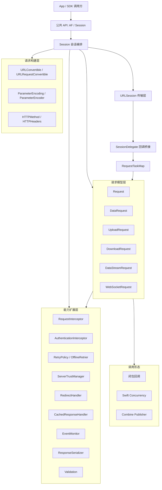
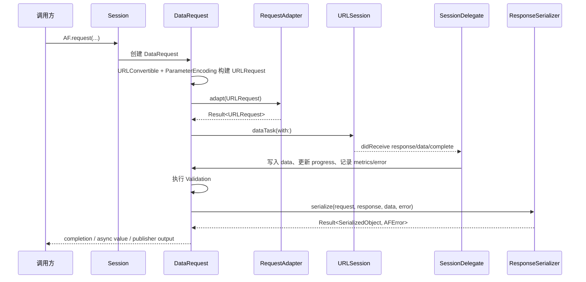
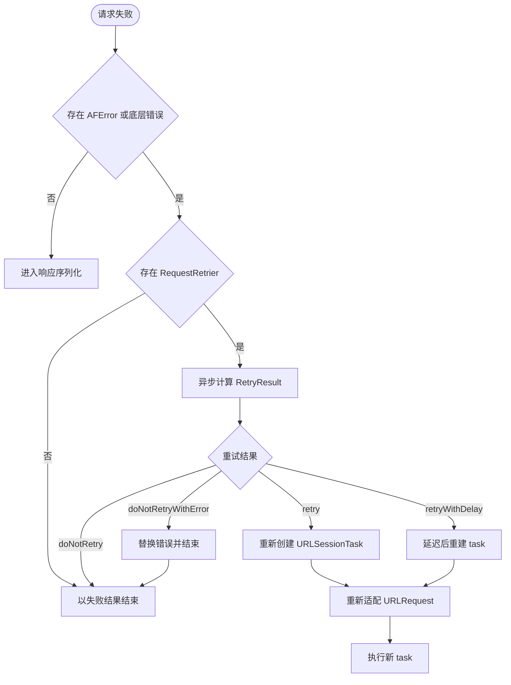
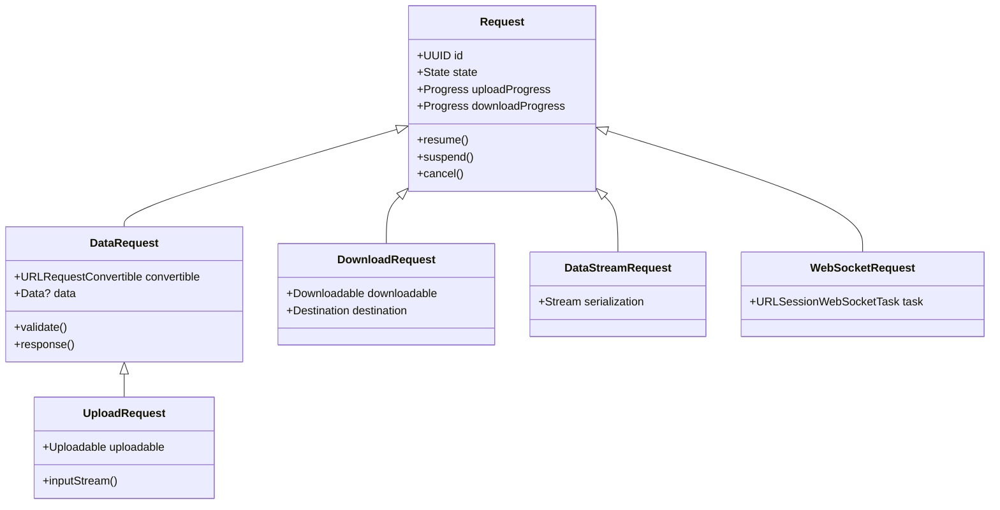
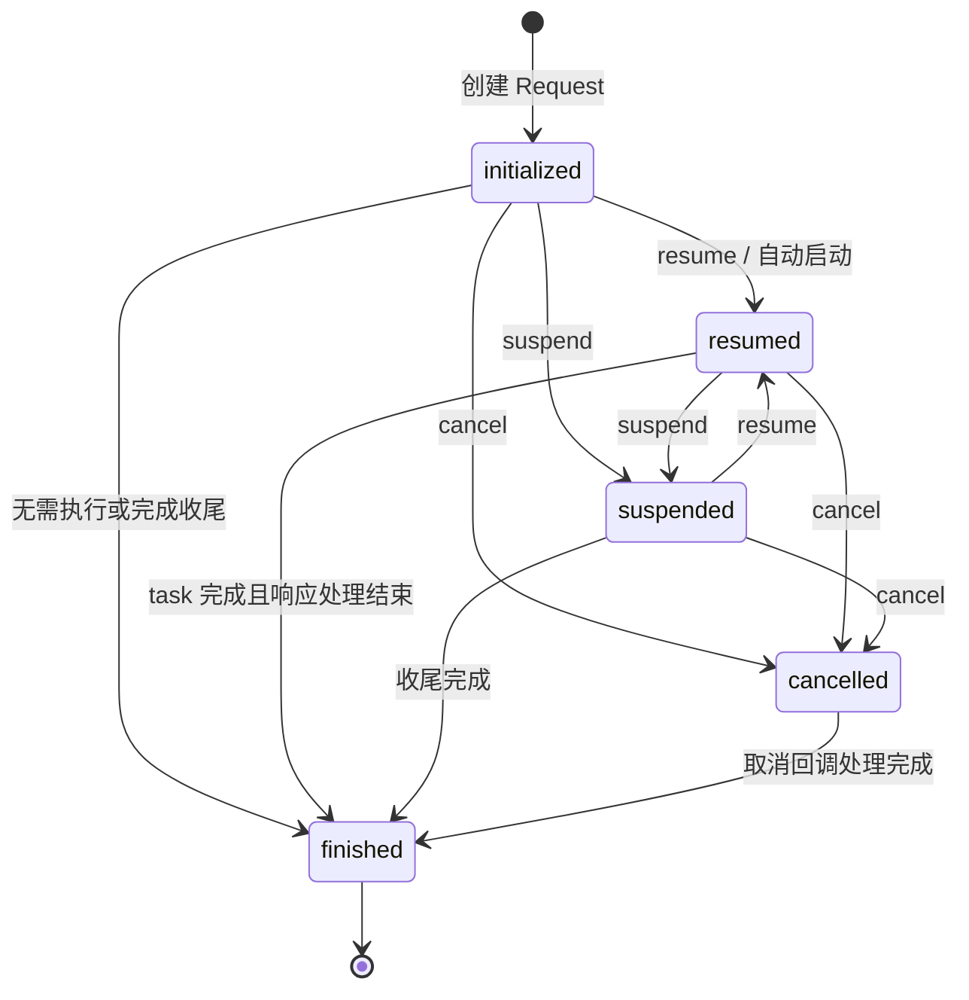

# Alamofire 概要设计文档

## 1. 设计概述

### 1.1 背景

Alamofire 是一个面向 Swift 应用和 SDK 的 HTTP 网络库，封装 Foundation `URLSession` 的常用与高级能力，提供链式请求 API、统一响应模型、可插拔拦截器、安全策略、缓存策略、响应序列化、上传下载、流式响应、WebSocket、Combine 和 Swift Concurrency 支持。

### 1.2 设计目标

- 提供比直接使用 `URLSession` 更简洁、更一致的 HTTP 请求 API。
- 保留底层 Foundation 网络能力，并允许调用方定制关键策略。
- 通过 `Session` 统一管理请求生命周期、队列、delegate 回调和状态。
- 支持多平台 Swift 包、CocoaPods 和 Xcode 工程集成。
- 为认证、重试、安全、缓存、监控、序列化等横切能力提供清晰扩展点。

### 1.3 设计原则

- 以 `URLSession` 为底座，不重新实现网络传输层。
- 以请求生命周期为中心组织核心模型。
- 通过协议暴露扩展点，通过默认实现覆盖常见场景。
- 将线程安全状态集中在串行队列和 `Protected` 封装中。
- 用条件编译隔离平台差异。

### 1.4 影响范围

本文档覆盖当前仓库中的 library target、测试、示例、文档和 CI 配置，不包含外部生态组件库。

## 2. 架构设计

### 2.1 核心组件职责

| 组件 | 职责 |
| --- | --- |
| `AF` | `Session.default` 的快捷入口，降低简单场景使用成本。 |
| `Session` | 创建请求，管理底层 `URLSession`、delegate、队列、请求映射、拦截器和策略对象。 |
| `SessionDelegate` | 接收 `URLSession` delegate 回调，并转发给对应的 Alamofire `Request`。 |
| `Request` | 请求基类，管理状态、任务、进度、metrics、错误、验证、序列化和生命周期事件。 |
| `DataRequest` | 常规数据请求。 |
| `UploadRequest` | 上传请求，复用 `DataRequest` 响应处理能力。 |
| `DownloadRequest` | 文件下载请求。 |
| `DataStreamRequest` | 流式响应请求。 |
| `WebSocketRequest` | WebSocket 请求。 |
| `RequestInterceptor` | 请求发出前适配和失败后重试决策。 |
| `ResponseSerializer` | 将原始响应转换成调用方需要的结果类型。 |
| `EventMonitor` | 观察请求和会话事件，用于日志、调试和指标采集。 |

## 3. 数据流设计

### 3.1 常规数据请求流程

### 3.2 失败重试流程

### 3.3 上传下载流程

- 上传：调用方传入 `Data`、文件 URL、`InputStream` 或 `MultipartFormData`，`Session` 创建 `UploadRequest`，再生成 upload task。multipart 场景会根据内存阈值决定在内存中编码或写入临时文件。
- 下载：`Session` 创建 `DownloadRequest`，通过 download task 获取临时文件位置，完成后按 `Destination` 策略移动文件，可处理 resume data。
- 进度：上传和下载进度由 `URLSessionTaskDelegate` 回调进入 `SessionDelegate`，再更新对应 `Request` 的 `Progress`。

## 4. 模块设计

### 4.1 请求类型关系

### 4.2 请求状态流转

### 4.3 特性模块划分

| 模块 | 输入 | 输出 | 关键约束 |
| --- | --- | --- | --- |
| 请求构建 | URL、method、headers、parameters、encoder | `URLRequest` | 编码失败要转换为 `AFError`。 |
| 拦截器 | 原始或重建的 `URLRequest`、失败的 `Request` | adapted request 或 retry decision | 适配和重试均为异步完成。 |
| 传输 | `URLSessionTask` | delegate events | 不允许调用方直接操作 Alamofire 管理的底层 task。 |
| 响应验证 | response、data、file URL | 成功或验证错误 | 验证失败会影响后续序列化结果。 |
| 响应序列化 | request、response、data/file、error | `Result<SerializedObject, AFError>` | 在序列化队列执行，避免阻塞内部状态队列。 |
| 事件监控 | 生命周期事件 | 日志、通知、指标 | 不应改变请求主流程语义。 |

## 5. 接口设计

### 5.1 主要公共入口

| 场景 | 入口 |
| --- | --- |
| 常规请求 | `AF.request(...)`、`Session.request(...)` |
| 上传 | `AF.upload(...)`、`Session.upload(...)` |
| 下载 | `AF.download(...)`、`Session.download(...)` |
| 流式响应 | `AF.streamRequest(...)`、`Session.streamRequest(...)` |
| WebSocket | `Session.webSocketRequest(...)`，当前标记为 SPI |
| 认证 | `Request.authenticate(...)`、`AuthenticationInterceptor` |
| 验证 | `Request.validate(...)` |
| 响应处理 | `response(...)`、`serializing...`、Combine publisher |
| 会话定制 | `Session(configuration:delegate:rootQueue:...)` |

### 5.2 关键协议

| 协议 | 用途 |
| --- | --- |
| `URLConvertible` | 将字符串、URL 等输入统一转换为 `URL`。 |
| `URLRequestConvertible` | 将路由对象或自定义对象转换为 `URLRequest`。 |
| `ParameterEncoding` | 对字典参数进行 URL 或 JSON 编码。 |
| `ParameterEncoder` | 对 `Encodable` 参数进行编码。 |
| `RequestAdapter` | 发出请求前修改 `URLRequest`。 |
| `RequestRetrier` | 请求失败后决定是否重试。 |
| `RequestInterceptor` | 同时提供适配和重试能力。 |
| `ResponseSerializer` | 定义响应序列化。 |
| `ServerTrustEvaluating` | 定义 TLS 信任评估。 |
| `CachedResponseHandler` | 定义缓存响应处理。 |
| `RedirectHandler` | 定义重定向处理。 |
| `EventMonitor` | 观察请求和 `URLSession` 事件。 |

## 6. 技术实现要点

### 6.1 会话和队列

- `Session` 要求 `rootQueue` 为串行队列。
- 默认 `requestQueue` 和 `serializationQueue` target 到 `rootQueue`。
- `URLSession` delegate queue 使用单并发 `OperationQueue`，底层队列与 `rootQueue` 对齐。
- 可变状态通过 `Protected` 封装，避免多线程直接读写。

### 6.2 请求映射

- `Session` 维护 `RequestTaskMap`，用于从 `URLSessionTask` 找回对应的 `Request`。
- `SessionDelegate` 只处理系统回调桥接，具体业务状态仍回写到对应请求。

### 6.3 错误模型

- 内部错误统一收敛到 `AFError`。
- 编码、验证、序列化、重试、安全评估、上传下载文件处理等场景都有对应错误分支。
- `Error.asAFError(or:)` 等辅助能力用于桥接外部错误。

### 6.4 平台差异

- `FoundationNetworking` 用于支持非 Darwin 平台。
- WebSocket 和部分安全能力依赖 Apple 平台 API，通过条件编译限制。
- README 标注 Linux、Windows、Android 可构建但不完整支持，CI 也主要验证构建能力。

### 6.5 文档与测试

- 手写文档在 `Documentation`。
- 生成 API 文档在 `docs`。
- 测试覆盖请求、会话、编码、序列化、上传下载、缓存、认证、重试、安全、并发和平台相关行为。
- GitHub Actions 覆盖多个 Xcode / Swift / 平台组合，并包含 CodeQL 分析。

## 7. 异常与边界处理

| 场景 | 处理策略 |
| --- | --- |
| URL 或参数编码失败 | 请求进入失败状态，返回 `AFError`。 |
| 认证挑战 | `SessionDelegate` 根据 credential 或 server trust evaluator 决策。 |
| TLS 信任失败 | 取消认证挑战，并记录 server trust 相关 `AFError`。 |
| HTTP 重定向 | 优先使用请求级 `RedirectHandler`，其次使用会话级处理器，默认跟随系统行为。 |
| 缓存响应 | 优先使用请求级 `CachedResponseHandler`，其次使用会话级处理器。 |
| 请求失败 | 交由 `RequestRetrier` 判断是否立即重试、延迟重试或结束。 |
| 上传流重建 | `SessionDelegate` 在 `needNewBodyStream` 中从 `UploadRequest` 获取新 stream。 |
| 下载文件移动失败 | 转换为下载相关 `AFError` 并返回给调用方。 |
| 请求取消 | 状态进入 `cancelled`，不可再恢复到其他执行状态。 |

## 8. 非功能设计

- 可维护性：核心层、特性层、扩展层边界清晰，测试按能力拆分。
- 可观测性：通过 `EventMonitor`、notifications、metrics、cURL 描述提供调试和监控入口。
- 可扩展性：编码、拦截、重试、序列化、安全、缓存、重定向均通过协议扩展。
- 跨平台：以 SwiftPM 和条件编译为基础支持多平台构建。
- 性能：请求构建和响应序列化可分别调度到独立队列，避免阻塞主线程和内部状态队列。

## 9. 验收标准对应

- 能通过 `AF` 和自定义 `Session` 创建常规请求、上传、下载、流式请求。
- 能通过验证、序列化、async/await、Combine 或回调获取结果。
- 能通过拦截器实现认证、签名、重试等横切逻辑。
- 能通过信任评估、重定向、缓存处理器定制底层网络行为。
- 能在测试 target 中覆盖新增或修改的请求生命周期行为。
- 能在 CI 覆盖的 Apple 平台和 SwiftPM 构建环境中保持构建通过。
