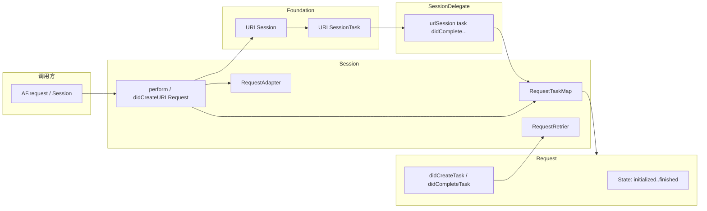
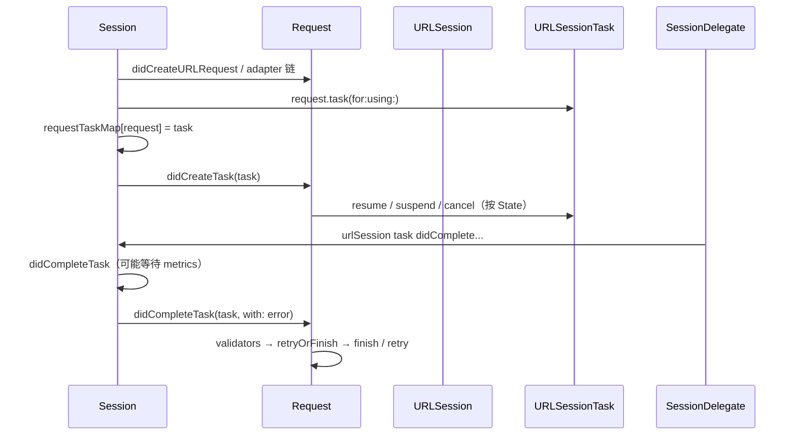

# Alamofire 源码协作：Session、SessionDelegate、RequestTaskMap 与 Request

本文基于 Alamofire 仓库 `Source/Core` 下的实现（`Session.swift`、`SessionDelegate.swift`、`RequestTaskMap.swift`、`Request.swift`），说明四者职责边界、调用顺序，以及复杂场景在**框架内**如何被支撑、哪些必须留在**业务层**设计。

交叉阅读：仓库内 `Documentation/Architecture.md`、`Documentation/HighLevelDesign.md`。

## 1. 总体分工（一句话）

- **`Session`**：编排中心——创建/适配 `URLRequest`、创建 `URLSessionTask`、维护 **task ↔ Request** 映射、调度 **Adapter/Retrier**、在 **`rootQueue`** 上与 delegate 对齐。
- **`SessionDelegate`**：薄适配层——实现 `URLSessionDelegate` 各方法；回调里只有 `URLSessionTask`，必须通过 **`SessionStateProvider.request(for:)`** 找到 `Request` 再转发。
- **`RequestTaskMap`**：**双向一对一** 映射 `URLSessionTask` 与 `Request`，并记录 **完成 / metrics** 两类事件，处理 **先后顺序不确定** 时的拆线逻辑。
- **`Request`**：领域模型——**状态机**、task 创建后的 resume/suspend/cancel 补操作、校验、**`retryOrFinish`**、响应序列化与 `finish`。

## 2. RequestTaskMap：为什么需要「双向 map + 事件位」

系统 delegate **只传 task**，不传 Alamofire 的 `Request`。因此必须维护：

- `tasksToRequests[task] -> Request`
- `requestsToTasks[request] -> task`

同时，较新的 `URLSession` 可能 **先 metrics 后完成** 或 **顺序变化**；部分平台（如 `FoundationNetworking`）**没有 metrics**。`RequestTaskMap` 用 `(completed, metricsGathered)` 协调：**只有两个事件都满足「可以拆线」的条件时**，才解除映射；否则通过 `Session` 侧的 `waitingCompletions` 延迟执行 completion。

**工程含义**：避免 task 已完成但 map 提前清空导致后续 delegate 找不到 `Request`，也避免重复 completion 破坏一致性。

## 3. Session 与 rootQueue：和 delegate 同一条「主线」

`Session` 初始化时对 `URLSession` 的 `delegateQueue` 有硬性前提：**其 `underlyingQueue` 必须就是传入的 `rootQueue`**。这样 `SessionDelegate` 的回调与 `Session` 内对 `RequestTaskMap` 的读写落在同一套串行调度语义上，降低「边改 map 边查 map」的竞态。

此外：

- **`requestQueue`**：异步构建 `URLRequest`（可单独队列，但通常 target 到 `rootQueue`）。
- **`serializationQueue`**：响应序列化（同理可 target 到 `rootQueue`）。

## 4. 协作时序：从建 task 到完成

### 4.1 建 task 与写入 map

`didCreateURLRequest` 在 **`rootQueue`** 上：若 `Request` 已取消则不再建 task；否则创建 task 并 **`requestTaskMap[request] = task`**，再 `request.didCreateTask(task)`。

### 4.2 Delegate 如何找到 Request

`SessionDelegate` 通过 `stateProvider?.request(for: task)` 查询；`Session` 实现为从 `requestTaskMap[task]` 取值。**所有** data/upload/download/metrics 类回调都遵循这一模式。

### 4.3 Request.didCreateTask：状态「补刀」

Task 创建可能与 `resume/cancel` 竞态：`didCreateTask` 内根据当前 `State` 决定立刻对 task 调用 `resume()`、`suspend()`，或在 **`cancelled`** 时 **先 `resume` 再 `cancel`**（注释说明是为了 **metrics 能收集**）。这与 `Request.cancel()` 里对已存在 task 的处理一致。

### 4.4 完成路径与重试

`didCompleteTask` 合并 error、跑 validators、再 **`retryOrFinish`**：

- 已 **`cancelled`** 或 **无 error / 无 delegate**：直接 `finish`。
- 否则异步问 **`Session` 的 retrier**（可能组合 session 与 request 的 `Interceptor`），得到 `retry` / `retryWithDelay` / `doNotRetry`。
- 重试路径：`retryRequest` 在 **`rootQueue`** 上 `prepareForRetry()` → `perform(..., forRetry: true)`，且 **`guard !request.isCancelled`**。

## 5. 复杂场景：框架覆盖到哪里、业务必须补什么

### 5.1 并发 Token 刷新（401 风暴）

Alamofire 提供 **`RequestAdapter`** 与 **`RequestRetrier`**，retrier 结果会 **`rootQueue.async`** 回到主线；**不内置**「全局单飞 refresh + 队列」。

**业务层**需要：刷新互斥、刷新后更新 adapter 可见的 token、非幂等请求与重试策略分离（见下节）。

### 5.2 取消竞态

- **URL 请求已适配、尚未建 task**：`didCreateURLRequest` 开头 `guard !request.isCancelled`。
- **已建 task**：`cancel()` 设置 `cancelled`，并对 task `resume`+`cancel`；若 task 已 `completed` 则不再 cancel，依赖 delegate 收尾。
- **重试**：`retryOrFinish` 首行 `guard !isCancelled`，取消后不会进入 retrier。

### 5.3 重试与幂等

框架重试的是 **同一个 `Request` 实例** 经过 `prepareForRetry` / `reset` 后的 **新一轮传输**；**不保证** 业务语义幂等。

**业务层**应对：支付/下单等用 **idempotency key**、服务端去重；retrier 对 **GET** 与 **POST** 区分；或仅在网络层错误重试、4xx 业务错误不重试。

### 5.4 上传流重建 `needNewBodyStream`

`SessionDelegate.urlSession(_:task:needNewBodyStream:)` 会 cast 为 **`UploadRequest`**，调用 **`request.inputStream()`** 交给系统。

**业务层**必须保证：**每次** 被请求新流时都能再提供可读数据（文件可读、或流可重建）；否则重定向/重试会失败。

### 5.5 跨平台与可观测、安全

- **跨平台**：`RequestTaskMap.disassociateIfNecessaryAfterCompletingTask` 对 **`canImport(FoundationNetworking)`** 等分支处理「无 metrics」场景，行为与 Apple 平台不完全相同——**集成 Linux/SwiftPM 时要单独测**。
- **可观测**：`EventMonitor` 贯穿 delegate 与 `Request` 生命周期事件。
- **安全合规**：`SessionDelegate` 中 server trust、credential challenge；失败可走 `didFailTask` early，但最终仍可能走 **`didCompleteWithError`** 统一完成路径，需在业务上理解错误模型。

## 6. 小结表

| 类型 | 核心职责 |
|------|-----------|
| `Session` | 编排、map、adapter/retrier、与 `URLSession` 配置一致 |
| `SessionDelegate` | 系统回调 → 查 Request → 转发 |
| `RequestTaskMap` | task↔request、metrics/完成顺序、跨平台拆线 |
| `Request` | 状态机、task 补操作、校验、重试决策入口、序列化 |

若你希望与 AFNetworking 对照阅读，可参见本站 `content/network` 下 AFNetworking 架构文与 `alamofire-vs-afnetworking.md`。
