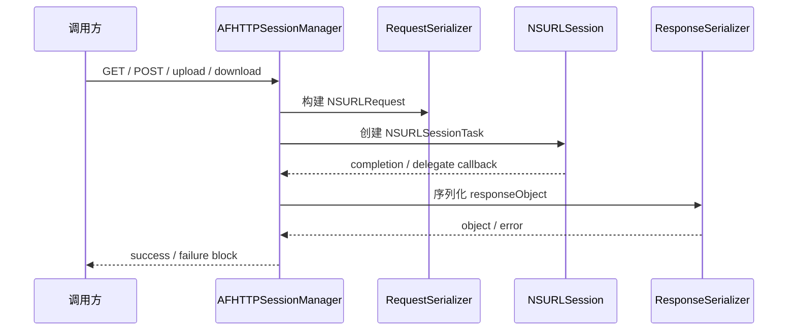
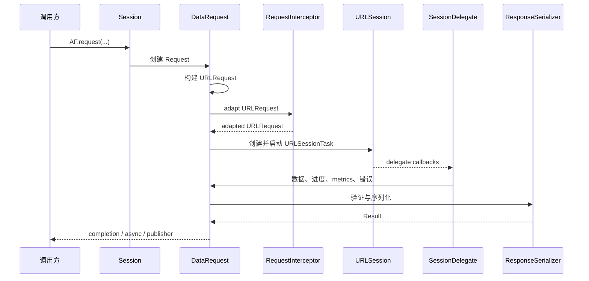

# Alamofire 与 AFNetworking 实现思维对比

本文档基于当前 Alamofire 项目实现，并结合 AFNetworking 的典型架构思路，整理两者在设计目标、抽象方式、请求生命周期、扩展机制和工程化方向上的异同。

## 1. 总体结论

Alamofire 和 AFNetworking 的核心思想相近：它们都没有重写网络传输层，而是在 Apple Foundation 网络能力之上做工程化封装，让业务代码更方便地发起 HTTP 请求、处理响应、管理安全策略和观察网络状态。

两者最大的差异来自语言和时代背景：

- AFNetworking 是 Objective-C 时代的网络库，核心思维是“封装 `NSURLSession` / `NSURLConnection` manager，让 ObjC 写网络更方便”。
- Alamofire 是 Swift 时代的网络库，核心思维是“围绕 `Request` 生命周期构建一套可组合、可观测、类型安全的网络抽象”。

## 2. 共同点

| 维度 | 共同设计思路 |
| --- | --- |
| 底层依赖 | 都基于 Apple Foundation 网络栈，不重新实现 HTTP 传输。 |
| 会话管理 | 都有会话管理器思想，用一个中心对象管理请求创建、配置和回调。 |
| 请求封装 | 都把 URL、method、headers、parameters、body 等请求细节封装起来。 |
| 响应处理 | 都提供响应序列化能力，把原始响应转换为 JSON、Data、String 或模型。 |
| 安全能力 | 都支持 TLS / SSL 相关安全策略和证书校验能力。 |
| 进度能力 | 都支持上传、下载和进度回调。 |
| 网络可达性 | 都提供网络状态监听能力。 |
| 业务减负 | 都把常见网络横切逻辑从业务代码中抽离出来。 |

## 3. 核心差异

| 维度 | Alamofire | AFNetworking |
| --- | --- | --- |
| 语言范式 | Swift、协议、泛型、值类型、`Result`、`Sendable`、async/await | Objective-C、继承、delegate、block、category、runtime |
| 核心对象 | `Session` + `Request` 族 | `AFURLSessionManager` / `AFHTTPSessionManager` + task |
| 请求抽象 | 明确建模 `DataRequest`、`UploadRequest`、`DownloadRequest`、`DataStreamRequest`、`WebSocketRequest` | 以 manager 方法创建 data/upload/download task |
| 生命周期 | `Request.State`、`RequestTaskMap`、队列、状态保护 | 更多依赖 `NSURLSessionTask`、manager 状态和 block 回调 |
| 扩展机制 | 协议组合：`RequestInterceptor`、`ResponseSerializer`、`EventMonitor` 等 | 类继承、serializer 对象、security policy、category |
| 重试与适配 | 内建 `RequestAdapter`、`RequestRetrier`、`RequestInterceptor` | 通常由业务层或二次封装实现 |
| 并发模型 | `rootQueue`、`requestQueue`、`serializationQueue`，并支持 Swift Concurrency / Combine | completion queue、operation queue、block 回调 |
| 类型安全 | 强类型、泛型 response、`Decodable`、统一 `AFError` | 动态类型较多，主要依赖 `id`、`NSError` 和运行时约定 |
| 可观测性 | `EventMonitor`、metrics、cURL、notifications | completion block、task metrics 和 manager 级 hook，体系相对弱 |
| 平台方向 | Swift 多平台构建，Apple 平台完整支持，非 Apple 平台部分能力受限 | 主要面向 Apple Objective-C / Cocoa 生态 |

## 4. 架构思维对比

### 4.1 AFNetworking：Manager 工具箱思维

AFNetworking 的核心抽象是 manager。业务通常围绕 `AFHTTPSessionManager` 或 `AFURLSessionManager` 配置 base URL、request serializer、response serializer、security policy 和 completion block。

这种设计非常符合 Objective-C 时代的开发习惯：

- 通过 manager 集中配置请求行为。
- 通过 serializer 对象处理请求和响应格式。
- 通过 block 接收成功或失败结果。
- 通过 subclass、category 或组合对象扩展能力。

它的优势是 API 直接、使用门槛低、和 Objective-C 生态契合度高。它的问题是类型安全较弱，请求生命周期没有被建模得很细，复杂的认证刷新、重试、事件监控通常需要业务层再次封装。

### 4.2 Alamofire：Request 生命周期思维

当前 Alamofire 项目以 `Session` 作为编排中心，但真正的行为围绕 `Request` 生命周期展开。`Session` 负责创建请求、管理 `URLSession`、delegate、队列和策略；`Request` 及其子类负责状态、任务、进度、验证、序列化、错误和完成回调。

这种设计更符合 Swift 时代的工程习惯：

- 用协议定义扩展点，例如 `RequestAdapter`、`RequestRetrier`、`ResponseSerializer`。
- 用强类型响应和 `Decodable` 提升类型安全。
- 用 `AFError` 收敛不同阶段的失败原因。
- 用队列和 `Protected` 管理并发状态。
- 用 async/await 和 Combine 适配现代调用方式。

它的优势是生命周期清晰、扩展点明确、组合能力强、可测试性和可观测性更好。代价是内部模型更复杂，理解成本比 AFNetworking 更高。

## 5. 请求生命周期对比

### 5.1 AFNetworking 的典型流程

AFNetworking 更强调 manager 方法调用和 block 回调，核心对象是 manager 与 serializer。

### 5.2 Alamofire 的典型流程

Alamofire 更强调请求对象本身的生命周期，`SessionDelegate` 只是系统回调到 `Request` 的桥梁。

## 6. 扩展机制对比

### 6.1 请求构建

- AFNetworking：通过 request serializer 配置参数编码、headers、Content-Type 等。
- Alamofire：通过 `URLConvertible`、`URLRequestConvertible`、`ParameterEncoding`、`ParameterEncoder`、`RequestModifier` 组合完成。

Alamofire 的拆分更细，也更符合 Swift 的强类型和协议化思维。

### 6.2 响应处理

- AFNetworking：通过 response serializer 把响应转换为 JSON、XML、image、data 等。
- Alamofire：通过 `ResponseSerializer`、`DataPreprocessor`、`DataDecoder`、`DecodableResponseSerializer` 等处理响应。

两者都有 serializer 思想，但 Alamofire 更强调泛型结果、`Decodable` 和统一错误模型。

### 6.3 认证、适配与重试

- AFNetworking：通常通过 manager 配置、serializer header、operation/task 回调或业务二次封装实现。
- Alamofire：内建 `RequestAdapter`、`RequestRetrier`、`RequestInterceptor` 和 `AuthenticationInterceptor`。

这是实现思维上的重要差异：Alamofire 将“请求发出前”和“请求失败后”的扩展点纳入生命周期，AFNetworking 更多依赖业务层组织。

### 6.4 事件观测

- AFNetworking：主要依赖 completion block、task delegate、通知或自定义 manager hook。
- Alamofire：提供 `EventMonitor`、`CompositeEventMonitor`、notifications、metrics 和 cURL 描述。

Alamofire 的观测能力更体系化，更适合日志、性能指标、链路追踪和调试工具接入。

## 7. 并发与状态管理对比

AFNetworking 来自 Objective-C 时代，主要使用 block、operation queue、completion queue 和 delegate 管理异步回调。它的模型直接贴近 `NSURLSessionTask`，状态管理更多由 manager 和系统 task 承担。

Alamofire 明确区分：

- `rootQueue`：内部状态更新的串行队列。
- `requestQueue`：请求构建和适配。
- `serializationQueue`：响应序列化。
- `Protected`：保护跨队列可变状态。
- `Request.State`：明确请求状态迁移。

因此，Alamofire 的实现更强调并发边界、状态一致性和生命周期可控性。

## 8. 类型系统与错误处理对比

AFNetworking 的 API 受 Objective-C 类型系统影响，常见结果类型是 `id responseObject` 和 `NSError *error`。这让 API 灵活，但编译期约束较弱，很多错误需要运行时判断。

Alamofire 借助 Swift 类型系统：

- 使用泛型和 `Decodable` 输出强类型模型。
- 使用 `Result` 表达成功和失败。
- 使用 `AFError` 统一网络库内部错误。
- 使用协议组合表达能力边界。
- 使用 `Sendable` 等并发标记适配 Swift 并发模型。

这使 Alamofire 的调用方能在编译期获得更多约束，错误分类也更稳定。

## 9. 设计取舍

### 9.1 AFNetworking 的优势

- Objective-C 项目集成自然。
- API 直观，manager + block 模式容易理解。
- 对历史项目、老代码和 ObjC 生态友好。
- 抽象相对轻，简单请求使用成本低。

### 9.2 AFNetworking 的局限

- 类型安全较弱。
- 复杂重试、认证刷新、事件监控通常需要业务二次封装。
- Swift Concurrency、Combine、`Decodable` 等现代 Swift 能力不是原生设计目标。
- 请求生命周期表达不如 Alamofire 清晰。

### 9.3 Alamofire 的优势

- Swift 原生，类型安全更强。
- 请求生命周期建模完整。
- 拦截、重试、认证、序列化、事件监控等扩展点清晰。
- 支持 async/await、Combine、`Decodable`。
- 更适合构建现代 Swift 网络基础设施。

### 9.4 Alamofire 的局限

- 内部抽象更多，源码理解成本更高。
- 对只需要简单请求的场景来说可能显得偏重。
- 部分能力依赖 Apple 平台 API，非 Apple 平台构建和功能支持存在边界。

## 10. 对业务网络层设计的启发

如果在业务项目中设计网络层，可以综合两者思路：

- 学习 AFNetworking 的简单入口：为业务提供清晰、低成本的常用 API。
- 学习 Alamofire 的生命周期建模：明确请求状态、重试、取消、序列化和回调边界。
- 学习 AFNetworking 的 manager 配置思路：用会话级对象承载 base URL、headers、安全策略和缓存策略。
- 学习 Alamofire 的协议扩展思路：用 adapter、retrier、serializer、event monitor 处理横切能力。
- 对简单业务保持 API 简洁，对复杂能力保留可插拔扩展点。

## 11. 一句话总结

AFNetworking 更像 Objective-C 时代的“HTTP Manager 工具箱”，重点是让 `NSURLSession` 更好用；Alamofire 更像 Swift 时代的“请求生命周期框架”，重点是让请求创建、执行、适配、重试、验证、序列化和观测都可组合、可测试、类型安全。
