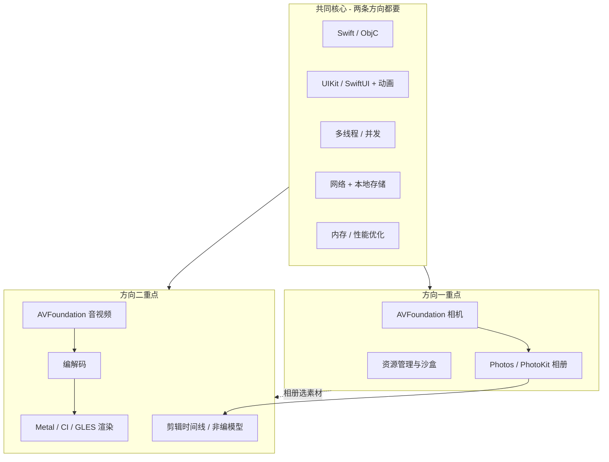

# iOS 相机/相册 & 音视频剪辑岗位 — JD 与技术栈

> 本文档包含：原始岗位职责与任职要求，以及按重要程度整理的技术栈（重点 / 扩展 / 关联）。

---

## 一、岗位职责

### 方向一：iOS 应用开发岗

1. 负责 iOS 平台的应用开发；
2. 负责相机、相册的应用架构设计、需求开发、体验优化；

### 方向二：iOS 音视频编辑应用开发岗

1. 负责 iOS 平台的相关应用开发；
2. 负责图片、视频剪辑的架构设计、需求开发、体验优化；

---

## 二、任职要求

### 方向一

#### 专业技能

1. 3 年及以上 iOS 应用开发经验，精通 Swift 或者 Objective-C；
2. 熟悉 iOS 平台上控件、动画、多线程、网络协议、数据库性能优化、内存优化等技术；

#### 通用素质

1. 本科及以上学历；
2. 具备一定的自我驱动能力，责任心强，沟通能力强；
3. 具备良好的技术视野，追求卓越，对问题刨根问底，能追根溯源；

### 方向二

#### 专业技能

1. 3 年及以上 iOS 应用开发经验，精通 Swift 或者 Objective-C；
2. 熟悉 iOS 平台上控件、动画、多线程、网络协议、数据库性能优化、内存优化等技术；
3. 熟悉 Metal、Core Image Kernel、OpenGLES 者更优；

#### 通用素质

1. 本科及以上学历；
2. 具备一定的自我驱动能力，责任心强，沟通能力强；
3. 具备良好的技术视野，追求卓越，对问题刨根问底，能追根溯源；
4. 具备相册、图片和视频剪辑相关工作经验者优先；
5. 具备音视频框架、音视频编解码、OpenGLES/Metal 渲染经验者优先；

---

## 三、技术栈总览

### 两条方向的关系

**图例说明**

- **重点**：必须深入掌握，面试与日常开发的核心
- **扩展**：加分项 / 进阶，按岗位方向选择性深入
- **关联**：与哪些技术一起学、在架构中的位置

---

## 四、共同核心（两条方向都排最前）

### 1. Swift / Objective-C 语言与工程化 — **重点**

| 深度 | 内容 |
|------|------|
| **重点** | Swift 语法、类型系统、协议与泛型、内存模型（ARC、循环引用、`weak`/`unowned`）、模块与 SPM/CocoaPods、与 ObjC 混编（`@objc`、`bridging header`） |
| **扩展** | Swift Concurrency（`async/await`、`Actor`）、宏与 Swift 6 并发检查、单元测试（XCTest）、CI（Fastlane、Xcode Cloud） |
| **关联** | 一切 UI、相机、剪辑代码的载体；性能问题最终都落到引用与生命周期 |

---

### 2. iOS 基础 UI、交互与动画 — **重点**

| 深度 | 内容 |
|------|------|
| **重点** | UIKit（`UIViewController` 生命周期、`Auto Layout`、自定义 View）、手势与触摸链、列表性能（`UICollectionView` 复用、预加载）、Core Animation（`CALayer`、`CAAnimation`、隐式/显式动画） |
| **扩展** | SwiftUI（新项目或混合栈）、`UIViewPropertyAnimator`、转场动画、Lottie |
| **关联** | 相册网格、剪辑时间轴、预览区、滤镜面板都依赖 UI + 动画；与「主线程只干 UI」强绑定 |

---

### 3. 多线程与并发 — **重点**

| 深度 | 内容 |
|------|------|
| **重点** | GCD（队列、组、`DispatchSemaphore`）、OperationQueue、主线程规则、线程安全（锁、串行队列保护共享状态）、`RunLoop` 与卡顿 |
| **扩展** | Swift Concurrency、`Combine` 背压、Instruments Time Profiler |
| **关联** | 解码/导出/滤镜必须后台；相机回调、相册 `PHImageManager` 回调与 UI 刷新要分清线程 |

---

### 4. 网络与数据持久化 — **重点（偏工程）**

| 深度 | 内容 |
|------|------|
| **重点** | URLSession、REST/上传下载、断点续传、缓存策略；本地存储（FileManager、沙盒目录、Core Data / SQLite / Realm 选型） |
| **扩展** | WebSocket、签名与安全存储（Keychain）、CloudKit / iCloud 相册同步概念 |
| **关联** | 云相册、模板素材、用户工程文件备份；与「大文件不进内存」一起设计 |

---

### 5. 内存与性能优化 — **重点（JD 明确写出）**

| 深度 | 内容 |
|------|------|
| **重点** | Instruments（Allocations、Leaks、VM Tracker）、大图/视频内存峰值、`autoreleasepool`、及时释放 `CVPixelBuffer` / `CMSampleBuffer`、后台任务与内存警告处理 |
| **扩展** | 启动优化、包体积、电量与 Thermal State、MetricKit |
| **关联** | 相机预览、4K 剪辑、滤镜链是内存重灾区；与 Metal/编解码直接相关 |

---

## 五、方向一专属：相机 + 相册

### 6. AVFoundation（相机采集管线）— **重点**

| 深度 | 内容 |
|------|------|
| **重点** | `AVCaptureSession`、`AVCaptureDevice`（前后摄、对焦曝光白平衡）、`AVCaptureVideoDataOutput` / `AVCapturePhotoOutput`、分辨率/FPS、方向与镜像、权限与中断（来电、切后台） |
| **扩展** | 多摄同开、深度数据、LiDAR、ProRAW、与 `AVAudioSession` 的录音配合 |
| **关联** | 相册选图后进入编辑（方向二）；预览层常用 `AVCaptureVideoPreviewLayer` 或自定义 `sampleBuffer` 渲染 |

---

### 7. Photos / PhotoKit（系统相册）— **重点**

| 深度 | 内容 |
|------|------|
| **重点** | `PHAsset`、`PHFetchOptions`、`PHImageManager`（同步/异步、目标尺寸、`deliveryMode`）、`PHPhotoLibrary` 变更监听、`PHPickerViewController`、Limited Library |
| **扩展** | Live Photo、Burst、iCloud 未本地下载资源、写入相册（`PHAssetCreationRequest`）、自定义相册 |
| **关联** | 与 FileManager 自建相册对比；剪辑 App 的「素材库」多半从这里取 `PHAsset` |

---

### 8. 图像表示与基础处理 — **重点（相册/相机向）**

| 深度 | 内容 |
|------|------|
| **重点** | `UIImage` / `CGImage`、色彩空间、sRGB、EXIF 方向、缩略图策略、Image I/O、基础裁剪旋转 |
| **扩展** | Core Image（`CIFilter` 管线）、Vision（人脸/场景，若做智能相册） |
| **关联** | 方向二会加深 CI/Metal；方向一先掌握「解码尺寸与内存」即可 |

---

### 9. 应用架构（相机/相册产品）— **重点**

| 深度 | 内容 |
|------|------|
| **重点** | 模块划分（拍摄 / 浏览 / 编辑 / 设置）、MVVM 或 Clean 在媒体 App 中的实践、状态机（拍摄中/预览/保存）、资源生命周期、可测试性（Protocol + 注入 `AVCaptureSession`） |
| **扩展** | 插件化滤镜、Feature Flag、多端配置 |
| **关联** | 与沙盒目录设计、缓存策略、崩溃恢复（未完成导出）一起考虑 |

---

## 六、方向二专属：图片/视频剪辑 + 渲染

### 10. 非线性编辑（NLE）领域模型 — **重点（业务核心）**

| 深度 | 内容 |
|------|------|
| **重点** | 时间线（Track/Clip）、入出点、裁剪、分割、转场、多轨（视频/音频/字幕/贴纸）、撤销重做、工程序列化与版本兼容 |
| **扩展** | 关键帧动画、曲线调速、蒙版、多分辨率预览策略 |
| **关联** | 上层 UI（时间轴控件）↔ 中层编辑引擎 ↔ 底层 AVFoundation/Metal 导出，三层要对齐数据模型 |

---

### 11. AVFoundation（合成、播放、导出）— **重点**

| 深度 | 内容 |
|------|------|
| **重点** | `AVPlayer` / `AVPlayerItem`、`AVAsset`、`AVMutableComposition`、`AVVideoComposition`、`AVAudioMix`、`AVAssetExportSession`、精确 seek、音画同步 |
| **扩展** | `AVAssetReader`/`Writer` 自定义管线、HDR、空间音频 |
| **关联** | 编解码（下一项）负责压缩格式；Metal/CI 负责实时预览特效 |

---

### 12. 音视频编解码 — **重点（方向二 JD 优先项）**

| 深度 | 内容 |
|------|------|
| **重点** | H.264/HEVC、AAC、容器（MP4/MOV）、码率、GOP、I/P/B 帧概念、`VideoToolbox`（硬编硬解）、导出参数与清晰度/体积权衡 |
| **扩展** | FFmpeg（若团队跨平台）、ProRes、WebM、直播 RTMP/HLS（若业务涉及） |
| **关联** | 导出慢/卡顿：查编解码线程 + 磁盘 IO + 内存；与 Metal 预览帧率分开优化 |

---

### 13. 图形渲染：Metal — **重点（方向二「更优」）**

| 深度 | 内容 |
|------|------|
| **重点** | Metal 管线（Device/CommandQueue/RenderPipeline）、纹理与 `CVPixelBuffer` 互操作、全屏滤镜、与 `CAMetalLayer` 预览 |
| **扩展** | Compute Shader、多 Pass、与 Core Image 混合 |
| **关联** | 实时预览性能优于纯 CPU；与 OpenGL ES 二选一深入即可（新项目优先 Metal） |

---

### 14. Core Image（含 Kernel）— **重点 / 扩展分界**

| 深度 | 内容 |
|------|------|
| **重点** | `CIImage` 管线、内置 `CIFilter`、链式处理、与 `UIImage`/`CVPixelBuffer` 转换 |
| **扩展** | **Core Image Kernel**（`CIKernel`、自定义 `.cikernel`）、Metal Performance Shaders 结合 |
| **关联** | 快速做美颜/调色/贴纸混合；重度自定义效果再下沉 Metal |

---

### 15. OpenGL ES — **扩展（legacy，了解即可）**

| 深度 | 内容 |
|------|------|
| **重点** | 无（除非维护老项目） |
| **扩展** | ES 2.0/3.0 基础、Shader、FBO；能读懂老代码并迁移到 Metal |
| **关联** | 与 Metal 概念平行（纹理、着色器、混合模式） |

---

### 16. 音频剪辑基础 — **重点（视频剪辑岗不可缺）**

| 深度 | 内容 |
|------|------|
| **重点** | `AVAudioSession` 类目、多轨混音、`AVAudioEngine` 或 composition 音轨、音量包络、降噪/变调（业务相关再深钻） |
| **扩展** | Audio Unit、第三方 SDK（如 Agora 仅当 JD 涉及实时通信） |
| **关联** | 导出时 `AVAudioMix`；预览卡顿常因主线程做了音频解码 |

---

## 七、按优先级的一页清单（合并两条方向）

| 优先级 | 技术 | 方向 | 深度 |
|--------|------|------|------|
| P0 | Swift + iOS 内存/ARC + Instruments | 共通 | **重点** |
| P0 | UIKit + Core Animation + 列表性能 | 共通 | **重点** |
| P0 | GCD / 线程模型 / 主线程 UI | 共通 | **重点** |
| P0 | AVFoundation 相机（Capture Session） | 一 | **重点** |
| P0 | PhotoKit / 相册权限与资源加载 | 一 | **重点** |
| P0 | AVFoundation 合成/播放/导出 | 二 | **重点** |
| P0 | 剪辑时间线领域模型 + 工程持久化 | 二 | **重点** |
| P1 | 网络 + 本地存储 + 大文件策略 | 共通 | **重点** |
| P1 | 图像基础（CGImage/色彩/EXIF/缩放） | 一→二 | **重点** |
| P1 | VideoToolbox / 编解码参数 | 二 | **重点** |
| P1 | Core Image 管线 | 二（一可浅） | **重点** |
| P2 | Metal 实时渲染 | 二 | **重点**（二岗）；**扩展**（一岗） |
| P2 | Core Image Kernel | 二 | **扩展** |
| P2 | Vision / 智能相册 | 一 | **扩展** |
| P2 | SwiftUI / Swift Concurrency | 共通 | **扩展** |
| P3 | OpenGL ES | 二 | **扩展**（维护向） |
| P3 | FFmpeg / 直播协议 | 二 | **扩展**（看业务） |

---

## 八、建议的学习路径（带关联）

### 若主攻方向一（相机/相册）

1. Swift + UIKit + GCD + Instruments（内存）
2. AVFoundation 相机全流程 → PhotoKit 浏览与写入
3. 大图加载与缓存架构 → 再补 Core Image 基础滤镜
4. **关联扩展**：了解 `AVMutableComposition` 与导出，便于和「拍完即剪」功能对接

### 若主攻方向二（剪辑）

1. Swift + UIKit（复杂自定义 View：时间轴）+ GCD
2. 非编数据模型 + `AVPlayer` 预览 + `AVMutableComposition` 导出
3. VideoToolbox + 编解码参数调优
4. Core Image → Metal 预览管线
5. **关联回溯**：PhotoKit 取素材、相机岗的 `sampleBuffer` 接口（外部滤镜/合拍）

### 两条都投

以 **P0 共通 + 方向一 PhotoKit/相机 + 方向二 Composition/编解码** 为「T 型」主干；Metal/Kernel 作为第二阶段的差异化深度。

---

## 九、面试与项目可落地的「证明点」

| JD 关键词 | 建议掌握的可讲项目点 |
|-----------|----------------------|
| 相机架构 | 自定义相机、前后摄切换、拍照/录像、内存与发热控制 |
| 相册体验 | 万级缩略图流畅滚动、iCloud 渐进加载、Limited 权限 |
| 剪辑架构 | 多轨时间线、撤销重做、后台导出、崩溃恢复 |
| 体验优化 | 首帧时间、seek 精度、导出耗时、OOM 案例与 Instruments 截图 |
| Metal/CI | 实时滤镜 60fps、自定义 Kernel 或 Metal 着色器一例 |

---

## 十、文档说明

- **来源**：岗位职责与任职要求来自招聘岗位 JD；技术栈部分按 JD 关键词拆解，并按重要程度标注重点、扩展与关联。
- **深度标记**：**重点** = 必须深入；**扩展** = 加分/进阶；**关联** = 建议与哪些模块一起学、在架构中的衔接关系。
